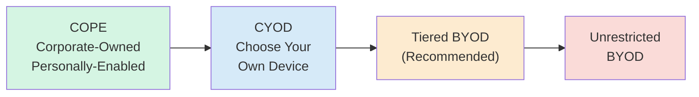
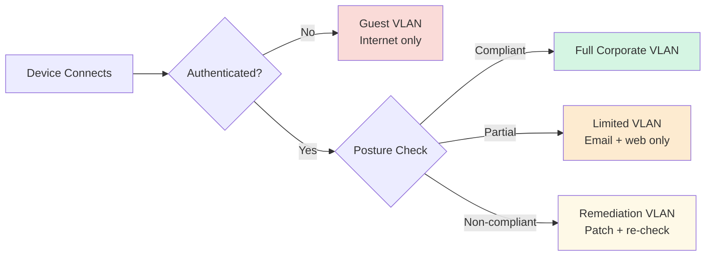
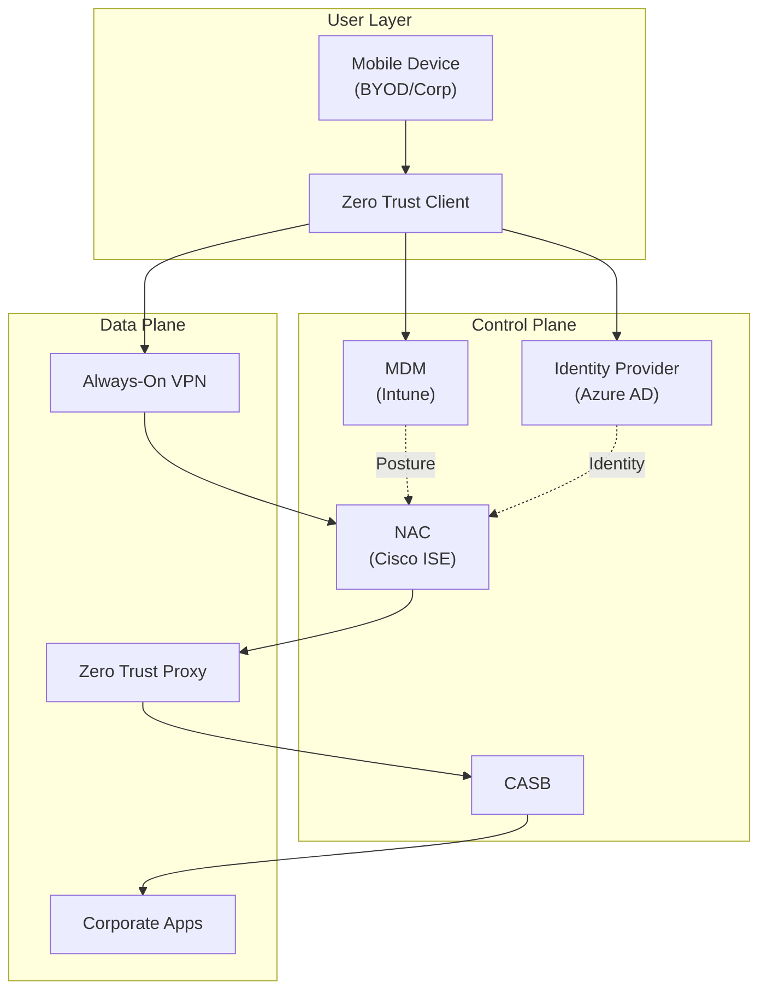

# BYOD Policy Framework — MDM · NAC · Zero Trust

> Synthesis of BYOD policy design, MDM architecture, NAC enforcement, and Zero Trust integration patterns. Derived from the Bluegreen Media capstone case study.

## Table of Contents

- [The BYOD Spectrum](#the-byod-spectrum)
- [Policy Decision Matrix](#policy-decision-matrix)
- [MDM Control Categories](#mdm-control-categories)
- [NAC Enforcement Tiers](#nac-enforcement-tiers)
- [Zero Trust Integration](#zero-trust-integration)
- [Reference Architecture](#reference-architecture)
- [Implementation Phasing](#implementation-phasing)
- [References](#references)

## The BYOD Spectrum

BYOD is not a binary policy. Four common models exist on a control-vs-flexibility spectrum:

| Model | Device Ownership | Control Level | Best Fit |
|---|---|---|---|
| **COPE** | Corporate | High | Regulated industries, privileged roles |
| **CYOD** | Corporate (user-selected) | High | Balances user preference with centralized control |
| **Tiered BYOD** | User | Medium (variable by tier) | Growing companies, diverse workforces |
| **Unrestricted BYOD** | User | Low | Not recommended for any corporate environment with sensitive data |

**Case Study Recommendation:** Bluegreen Media adopted **Tiered BYOD** — preserving cost benefits during growth phase while providing differentiated controls by data sensitivity and user role.

## Policy Decision Matrix

Five dimensions to decide BYOD model per user/device/data combination:

| Dimension | Low Sensitivity | Medium Sensitivity | High Sensitivity |
|---|---|---|---|
| **Data accessed** | Corporate email, calendar | Internal apps, CRM read | Customer PII, financial data |
| **User role** | Knowledge worker | Sales, account rep | Executive, IT admin |
| **Device trust** | Personal, minimal MDM | Personal, full MDM + container | Corporate-owned only |
| **Network access** | Internet-only, corporate VPN | Corporate VLANs via VPN | Privileged network segments |
| **Enforcement** | Policy acknowledgment | MDM enrollment + conditional access | Hardware-backed device attestation |

## MDM Control Categories

Every mature MDM deployment (e.g., Microsoft Intune, VMware Workspace ONE, Jamf) enforces controls across seven categories:

### 1. Device Enrollment & Identity

- Formal enrollment workflow (user-initiated with IT approval)
- Certificate-based device identity (SCEP / PKI integration)
- Device ownership classification (corporate vs BYOD)
- Automated onboarding + offboarding

### 2. Device Configuration

- Mandatory full-device encryption
- Password/PIN/biometric enforcement
- Auto-lock timeout (≤ 5 minutes for high-sensitivity)
- Wi-Fi / VPN profile provisioning
- Email client configuration

### 3. Application Management

- Enterprise app catalog (approved apps only)
- App whitelisting / blacklisting
- Per-app VPN for sensitive corporate apps
- App containerization (separate corporate data from personal)
- Mobile Application Management (MAM) for BYOD (without full device enrollment)

### 4. Data Protection

- Corporate vs personal data separation
- DLP on corporate containers
- Restricted cross-container data sharing
- Corporate clipboard isolation
- Screenshot / screen recording restrictions

### 5. Compliance & Posture

- OS version enforcement (minimum required version for network access)
- Jailbreak / root detection with automated response
- Configuration compliance checking
- Certificate expiry monitoring
- Non-compliance quarantine + remediation

### 6. Threat Detection

- Mobile Threat Defense (MTD) integration
- Malicious app detection
- Network attack detection (rogue Wi-Fi, SSL stripping)
- Behavioral anomaly detection

### 7. Remote Response

- Selective wipe (corporate data only for BYOD)
- Full wipe (corporate-owned devices)
- Device lock via IT or user self-service portal
- Network disconnect via NAC integration
- Audit trail for all remote actions

## NAC Enforcement Tiers

Network Access Control applies tiered policy based on device posture:

**Enforcement Tiers:**

| Tier | Network Access | Criteria |
|---|---|---|
| Guest | Internet only, no internal services | Unauthenticated or BYOD without MDM enrollment |
| Remediation | Patch servers + MDM server only | MDM-enrolled but non-compliant (outdated OS, missing patches) |
| Limited | Email, web apps, basic corporate services | MDM-enrolled, partially compliant, BYOD tier |
| Full | All authorized corporate services | MDM-enrolled, fully compliant, corporate-owned or top-tier BYOD |

**NAC Integration Points:**

- **802.1X** port-level authentication (wired + wireless)
- **RADIUS** centralized auth server
- **Dynamic VLAN assignment** based on device posture
- **MDM integration** for real-time posture queries
- **WIPS integration** for rogue device response

## Zero Trust Integration

Zero Trust replaces the implicit network-perimeter trust model with continuous verification. For mobile/BYOD, this translates to five enforcement patterns:

### Pattern 1 — Identity-Centric Access

- Every resource request re-authenticates the user (OAuth 2.0 / OIDC + MFA)
- Device identity is a separate factor (certificate-based)
- Context (location, time, device posture) adjusts trust score

### Pattern 2 — Continuous Device Posture Assessment

- Device posture queried at every sensitive resource request
- Changes in posture (root detected, OS patch missing) revoke access immediately
- MDM integration provides real-time posture feed

### Pattern 3 — Microsegmentation

- Corporate applications segmented by function and data sensitivity
- Mobile devices access only the specific apps their role requires
- Lateral movement from mobile compromise is bounded

### Pattern 4 — Encrypted Everywhere

- All traffic TLS-encrypted (even internal)
- Per-app VPN tunnels for sensitive applications
- TLS certificate pinning for corporate apps

### Pattern 5 — Assume Breach

- Network location provides zero trust uplift
- Every device is treated as potentially compromised
- Logging and behavioral analytics detect anomalies post-compromise

## Reference Architecture

## Implementation Phasing

Four-phase rollout (from Bluegreen Media case study):

| Phase | Duration | Activities |
|---|---|---|
| **1. Planning & Preparation** | Weeks 1-4 | Policy documentation, infrastructure standup, training materials, communication plan |
| **2. Pilot** | Weeks 5-8 | Deploy to IT staff + selected test users, collect feedback, tune controls, develop metrics |
| **3. Full Deployment** | Weeks 9-12 | Roll out to all employees, training, compliance monitoring begins, policy review cycle established |
| **4. Ongoing Management** | Continuous | Regular compliance reviews, policy updates for emerging threats, user experience improvements |

## References

- [NIST SP 800-124r2 — Guidelines for Managing Mobile Device Security](https://csrc.nist.gov/publications/detail/sp/800-124/rev-2/final)
- [NIST SP 800-207 — Zero Trust Architecture](https://csrc.nist.gov/publications/detail/sp/800-207/final)
- [CIS Controls v8 — Implementation Group 1-3](https://www.cisecurity.org/controls/v8)
- [Microsoft Intune BYOD Documentation](https://learn.microsoft.com/en-us/mem/intune/)
- [Cisco ISE NAC Documentation](https://www.cisco.com/c/en/us/products/security/identity-services-engine/)

---

*Ross Moravec | Mobile Wireless Security Portfolio*
