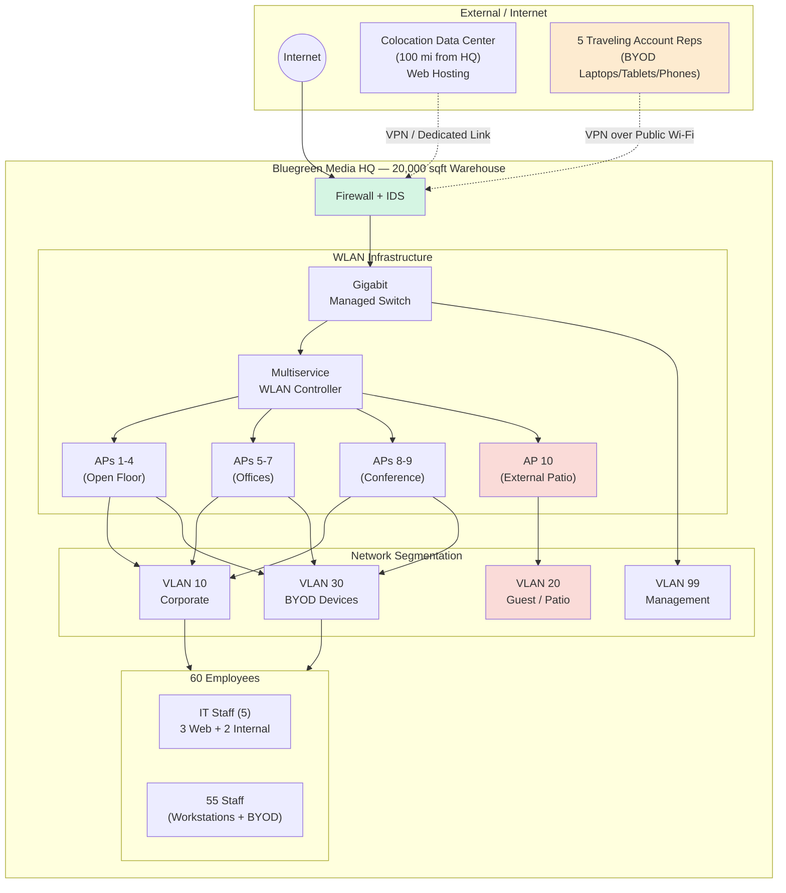
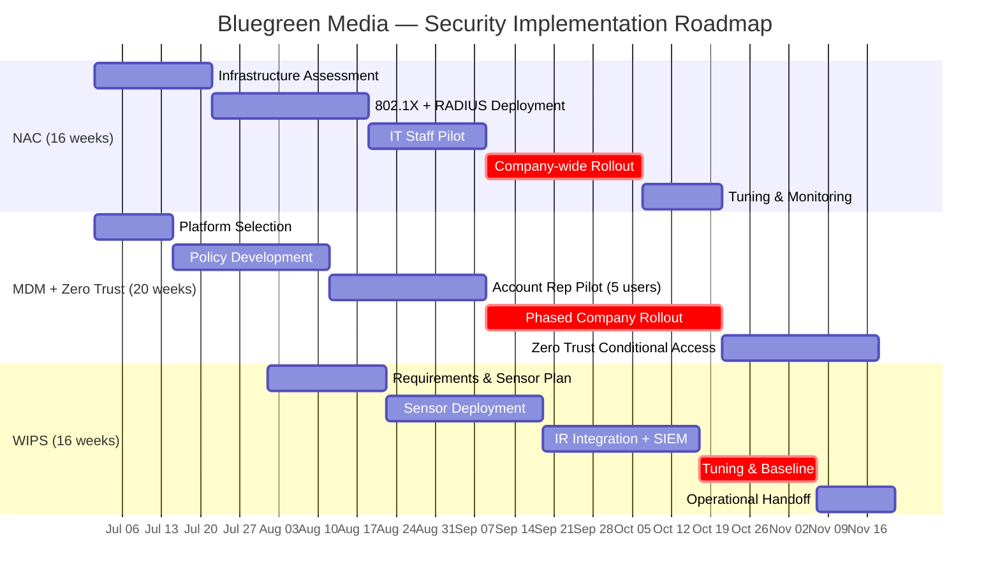

# Capstone — Bluegreen Media WLAN & Mobile Security Plan

> Week 6 · Delivered 2025-02-12 · Comprehensive WLAN and mobile security plan for a fictional 60-employee social media company considering an IPO.

## Table of Contents

- [Client Scenario](#client-scenario)
- [Part 1 — Vulnerability Analysis Plan](#part-1--vulnerability-analysis-plan)
- [Part 2 — Audit & Risk Assessment Plan](#part-2--audit--risk-assessment-plan)
- [Part 3 — BYOD Policy Framework](#part-3--byod-policy-framework)
- [Strategic Recommendations](#strategic-recommendations)
- [Presentation Summary](#presentation-summary)
- [Lessons Learned](#lessons-learned)

## Client Scenario

**Company:** Bluegreen Media (fictional)

**Profile:**

- Fast-growing social media provider targeting young urban professionals
- Launched 1 year ago via kick-start campaign
- 60 employees, 20,000-square-foot converted warehouse facility
- CEO Jennifer, considering going public in the near future

**IT Infrastructure:**

| Asset Class | Current State |
|---|---|
| WLAN | Gigabit managed switch, multiservice WLAN controller, 10 APs (including 1 for external patio area) |
| Security | Firewall + IDS |
| Mobile | 5 traveling account reps with company-issued laptops/tablets/smartphones |
| IT Team | 5 staff (3 website maintenance, 2 internal IT) |
| Policy | BYOD environment (cost-control decision at launch) |
| Hosting | Website colocated at data center 100 miles from HQ |

**Business Drivers for the Security Plan:**

1. CEO concerns about WLAN and mobile security risks as the company scales
2. BYOD policy viability evaluation (preserve cost benefits vs address security gaps)
3. Recommendations for a security posture that can support anticipated growth and IPO readiness

### Network Topology

> **Key risk areas:** The external patio AP (AP 10) extends the corporate RF footprint beyond the physical building. The 5 traveling reps connecting over public Wi-Fi represent the highest-risk BYOD segment. VLAN segmentation is the primary compensating control separating guest, BYOD, and corporate traffic.

## Part 1 — Vulnerability Analysis Plan

### Top Three WLAN Threats

**1. Rogue Access Points (APs)**

- Unauthorized wireless devices connected to the corporate network
- Deployment vectors: external attackers, well-intentioned employees extending coverage, malicious insiders bypassing controls
- Risk amplifier: 10 APs across 20,000 sqft including external patio → high surface area for rogue blending
- Impact: backdoors past perimeter, credential capture via MITM, lateral movement, data exfiltration
- Industry stat cited: 24% of SMB breaches involve wireless infrastructure; 40% of those via rogue APs

**2. Evil Twin Attacks**

- AP spoofing using identical/similar SSIDs
- Attack tools: inexpensive/portable (Raspberry Pi + wireless adapters)
- BYOD amplifier: personal devices auto-connect to known SSIDs, lack enterprise-grade validation, store multi-network profiles
- Highest risk to: 5 traveling account reps connecting to various networks in transit

**3. WPA2/WPA3 Protocol Vulnerabilities**

- KRACK (Key Reinstallation Attacks) affecting WPA2
- Dragonblood vulnerabilities in early WPA3 implementations
- Downgrade attacks forcing fallback to weaker protocols
- Root cause: irregular firmware patching (62% of SMBs don't update AP firmware regularly)

### Top Three Mobile Threats

**1. Advanced Persistent Mobile Threats via Malicious Applications**

- Trojanized apps, modified legitimate apps, enterprise-targeted spyware
- Post-infection capabilities: corporate data access, credential capture (keylogging, screen recording), camera/mic activation, persistent backdoors
- BYOD amplifier: traveling reps accessing corporate network remotely → compromised personal device = compromise of corporate assets

**2. Sophisticated Phishing / Social Engineering**

- Smishing (SMS phishing), vishing (voice phishing), QR code phishing
- Spear-phishing using social media profile data
- Mobile-specific vulnerabilities: smaller screens hinder URL verification, limited browser security indicators, rapid response habits

**3. Data Leakage via Cloud Sync & Insecure APIs**

- Auto-sync of corporate data to personal cloud accounts (Google Drive, Dropbox)
- Insecure API implementations in mobile apps
- Weak cloud service authentication
- Cross-app data sharing enabled by default
- Industry stat cited: 84% of employees use personal cloud storage for work; 27% have accidentally shared sensitive info

### Vulnerability Analysis Methodology

Five-phase assessment:

| Phase | Focus | Tools |
|---|---|---|
| 1. Network Discovery & Asset Inventory | Complete WLAN/mobile topology map | Ekahau Site Survey, Nmap, Advanced IP Scanner, Kismet, MDM integration |
| 2. Security Configuration Assessment | Compare against CIS benchmarks + NIST | Acrylic WiFi Professional, WLAN controller audit scripts, MDM reports |
| 3. Penetration Testing | Controlled attack simulation | Aircrack-ng, Wireshark, WiFi Pineapple, OWASP Mobile Security Testing Guide |
| 4. Mobile Device Security Assessment | MDM coverage + compliance | Microsoft Intune, mobile scanners, app risk analysis, VPN traffic analysis |
| 5. Documentation & Risk-Based Reporting | Business-intelligence translation | Vulnerability mgmt platform, CVSS scoring, executive/technical report templates |

## Part 2 — Audit & Risk Assessment Plan

### WLAN Audit Procedures

| Audit | Frequency | Focus |
|---|---|---|
| Wireless Infrastructure Configuration Audit | Quarterly | Baseline compliance, firmware, SSID config, 802.1X, segmentation, management interface security |
| Wireless Network Security Control Testing | Monthly | Signal leakage, rogue AP detection, WIPS effectiveness, NAC verification, guest isolation |
| Wireless Traffic Analysis | Bi-monthly | Anomaly detection, encryption verification, DoS indicators, evil twin susceptibility |

### Mobile Device Audit Procedures

| Audit | Frequency | Focus |
|---|---|---|
| Mobile Device Inventory & Compliance | Monthly | MDM enrollment reconciliation, OS/patch levels, jailbreak/root detection, encryption status |
| Mobile Application Security Audit | Quarterly | Application inventory, permissions review, vulnerability scanning, enterprise app deployment |
| Mobile Access & Authentication Audit | Bi-monthly | VPN config, MFA, email/data controls, certificate rotation, geofencing, session handling |

### Risk Assessment Framework

Aligned with **NIST SP 800-30** and **ISO 27005**. Four-phase methodology:

1. **Risk Identification & Categorization** — STRIDE + PASTA threat modeling, risk register, threat-to-asset mapping
2. **Risk Analysis & Evaluation** — Quantitative + qualitative scoring across financial/operational/reputational/regulatory dimensions, 5x5 matrix, heat maps
3. **Risk Treatment Planning** — Mitigate / transfer / accept / avoid decisions; control selection per NIST CSF + CIS Controls
4. **Risk Monitoring & Review** — KRIs, executive dashboards, incident correlation with risk register

## Part 3 — BYOD Policy Framework

**Recommendation:** Tiered BYOD model with enhanced security controls.

**Rationale:**

- Preserves cost benefits during growth phase
- Maintains employee flexibility and satisfaction
- Addresses security concerns through tiered controls
- Provides a scalable framework

**Framework Components:**

| Component | Requirements |
|---|---|
| **Device Eligibility & Registration** | Approved manufacturer/model list, min hardware specs, supported OS versions, formal registration process, lifecycle management procedures |
| **Security Requirements & Controls** | Mandatory encryption, strong auth (PIN/password/biometrics), auto-lock, limited login attempts before wipe, app whitelist/blacklist, containerization, jailbreak/root prohibition, mandatory VPN, certificate-based network auth, OS update requirements |
| **Data Protection & Privacy** | Corporate vs personal data definition, DLP controls, app data sharing restrictions, transparent monitoring disclosures, selective wipe, end-user self-service portal |
| **Support & Compliance** | Defined support boundaries, self-help resources, automated compliance checking, graduated violation response, mandatory BYOD training |
| **Legal & Regulatory** | Acceptable use guidelines, liability/ownership clarification, regulatory compliance alignment, audit procedures |

**Implementation Phases:**

- Phase 1 (Weeks 1-4): Planning & Preparation
- Phase 2 (Weeks 5-8): Pilot with IT + test groups
- Phase 3 (Weeks 9-12): Full Deployment
- Phase 4 (Continuous): Ongoing Management

Details: [BYOD_POLICY_FRAMEWORK.md](BYOD_POLICY_FRAMEWORK.md)

## Strategic Recommendations

### Recommendation #1 — Network Access Control (NAC)

**Candidates:** Cisco ISE · Aruba ClearPass · Forescout

**Architecture:**

- 802.1X integration with existing network infrastructure
- RADIUS authentication servers
- Device-type + posture-based network segmentation
- Guest network isolation with captive portal
- Certificate-based authentication for corporate devices
- Dynamic VLAN assignment

**Deployment Timeline:** 16 weeks (infrastructure → deployment → IT pilot → company rollout)

**Rough Order-of-Magnitude (ROM) Cost Estimate:**

| Cost Component | Estimate (60 users) |
|---|---|
| NAC Platform License (Cisco ISE / Aruba ClearPass) | $30,000–80,000 initial |
| Annual Subscription / Maintenance | $12,000–20,000/year |
| RADIUS Server Infrastructure | $5,000–15,000 (if not existing) |
| Professional Services (deployment) | $15,000–30,000 |
| **Total Year 1** | **$62,000–145,000** |
| **Annual Recurring** | **$12,000–20,000** |

> ROM estimates based on publicly available vendor list pricing for 60-user deployments. Actual costs vary by vendor selection, existing infrastructure, and negotiated discounts. Forescout typically falls at the lower end; Cisco ISE at the higher end.

**NAC Vendor Comparison:**

| Criterion | Cisco ISE | Aruba ClearPass | Forescout |
|---|---|---|---|
| **Market Position** | Leader (Gartner MQ) | Strong challenger | Agentless leader |
| **802.1X Support** | Native | Native | Native |
| **Agentless Discovery** | Limited (requires pxGrid) | Moderate | Best-in-class |
| **MDM Integration** | Cisco Meraki native; third-party via API | Strong third-party API | Broad third-party API |
| **Cloud/Hybrid** | ISE 3.x cloud option | ClearPass cloud | eyeSight cloud |
| **BYOD Onboarding** | Good (ISE Guest + BYOD portal) | Excellent (OnGuard) | Moderate |
| **Typical 60-User Cost** | $50,000–80,000 | $30,000–55,000 | $25,000–45,000 |
| **Best For** | Cisco-heavy environments | Multi-vendor, BYOD-heavy | Agentless IoT/OT + IT |
| **Bluegreen Fit** | ★★★ | ★★★★ | ★★★★ |

> **Recommendation for Bluegreen Media:** Aruba ClearPass or Forescout. ClearPass offers the strongest BYOD self-service onboarding (critical for 5 traveling reps); Forescout excels at agentless discovery (useful for IoT devices that may appear as the company grows). Cisco ISE is the best choice only if Bluegreen standardizes on Cisco infrastructure.

**Expected Results:** 100% device visibility, 95% reduction in unauthorized connections, automated compliance enforcement

### Recommendation #2 — MDM with Zero Trust Integration

**Primary Candidate:** Microsoft Intune

**Architecture Layers:**

1. **MDM Platform Selection & Deployment** — enrollment workflows, config profiles, automated onboarding/offboarding, enterprise app catalog
2. **Device Security Controls** — full-device + app-level encryption, biometric/PIN, certificate-based identity, remote wipe (selective + full), jailbreak/root detection
3. **Application & Data Management** — whitelist/blacklist, app containerization, per-app VPN, MAM, DLP
4. **Zero Trust Integration** — continuous device auth, context-aware access policies, conditional access, real-time posture assessment, threat intelligence integration

**Deployment Timeline:** 20 weeks (selection → policy dev → account-rep pilot → phased company-wide)

**Rough Order-of-Magnitude (ROM) Cost Estimate:**

| Cost Component | Estimate (60 users) |
|---|---|
| Microsoft Intune (Plan 2) | $6–12/user/month ($4,320–8,640/year) |
| Azure AD P2 / Entra ID P2 (Conditional Access) | $9/user/month ($6,480/year) |
| Mobile Threat Defense Add-on | $3–5/user/month ($2,160–3,600/year) |
| Professional Services (deployment + policy dev) | $20,000–40,000 |
| **Total Year 1** | **$33,000–58,000** |
| **Annual Recurring** | **$13,000–19,000** |

> Pricing based on Microsoft 365 E3/E5 licensing tiers with Intune Plan 2 add-on. Organizations already on Microsoft 365 E5 may have Intune bundled, reducing incremental cost significantly.

**Expected Results:** 99% compliance rate, enhanced data protection through containerization, reduced mobile incidents

### Recommendation #3 — Advanced WLAN Security Monitoring (WIPS)

**Architecture Layers:**

1. **Wireless Intrusion Prevention System (WIPS)** — dedicated sensors facility-wide, rogue AP detection + containment, evil twin detection, DoS identification/mitigation
2. **Advanced Threat Detection** — behavior-based anomaly detection, signature-based attack recognition, ML for novel attacks, honeypot networks
3. **Incident Response Integration** — wireless-specific playbooks, automated containment, SIEM/SOC integration, threat hunting
4. **Wireless Security Analytics** — comprehensive logging, historical trend analysis, executive dashboards

**Deployment Timeline:** 16 weeks (requirements → sensor deployment → IR integration → tuning)

**Rough Order-of-Magnitude (ROM) Cost Estimate:**

| Cost Component | Estimate (20,000 sqft) |
|---|---|
| WIPS Sensors (8–12 dedicated) | $500–1,500/sensor ($4,000–18,000) |
| WIPS Controller / Management | $10,000–25,000 |
| SIEM Integration (if not existing) | $15,000–40,000/year |
| Annual Sensor Subscription | $3,000–8,000/year |
| Professional Services | $10,000–20,000 |
| **Total Year 1** | **$39,000–101,000** |
| **Annual Recurring** | **$18,000–48,000** |

> Sensor count based on ~1 sensor per 2,000 sqft for full RF coverage. Dedicated overlay sensors (vs AP-integrated) provide better detection fidelity but at higher cost. SIEM integration cost depends on existing SOC tooling.

**Expected Results:** 95% reduction in dwell time for wireless attacks, automated response, comprehensive audit trail

### Combined Implementation Roadmap

> **Dependencies:** NAC should reach company-wide rollout before WIPS operational handoff to ensure device authentication is in place when WIPS begins enforcing containment policies. MDM runs in parallel but the Zero Trust conditional access phase should follow NAC deployment to leverage device posture data from both systems.

## Presentation Summary

**Delivery:** 2025-03-05 · 10-slide deck

**Agenda:**

1. Executive Summary
2. Company Security Profile
3. WLAN & Mobile Threat Landscape
4. Vulnerability Analysis Results
5. Audit Findings
6. Risk Assessment Summary
7. BYOD Security Evaluation
8. BYOD Policy Recommendation
9. Strategic Recommendations (NAC / MDM / WIPS)
10. Implementation Timeline & Expected Outcomes

**Artifact:** [CaseStudy_Final_Presentation.pdf](assignments/CaseStudy_Final_Presentation.pdf)

> **Note for reviewers:** The presentation slides were designed as visual prompts for verbal delivery in an academic setting and contain category headers rather than detailed analysis. The substantive findings, specific risks, metrics, and recommendations are documented in full in this written plan and in [CYBER_KILL_CHAIN_ANALYSIS.md](CYBER_KILL_CHAIN_ANALYSIS.md). The slides should be evaluated as a delivery framework, not a standalone document.

## Lessons Learned

1. **Threat analysis must tie back to business impact, not just technical severity.** The case study deliberately cited industry statistics (24% of SMB breaches involve wireless, 84% of employees use personal cloud storage, etc.) to translate technical findings into executive-level business risk language. This framing is what separates "security person explaining a risk" from "consultant helping the CEO make a decision."

2. **BYOD isn't binary.** The most defensible BYOD posture is *tiered* — different device/user combinations get different levels of trust and corporate data access. Treating BYOD as a single yes/no policy question loses the nuance where security actually lives.

3. **NAC + MDM + WIPS is a complete defensive triangle for wireless.** NAC controls what devices can connect; MDM controls what those devices can do once connected; WIPS detects when something malicious is happening despite the other controls. Each alone is necessary but insufficient.

4. **Phased deployment is a risk-management strategy, not just a project-management convenience.** Piloting with IT → account reps → company-wide rollout contains blast radius if the tooling misconfigures and lets you tune controls against real user behavior before committing.

## References

- [NIST SP 800-30 Rev. 1 — Guide for Conducting Risk Assessments](https://csrc.nist.gov/publications/detail/sp/800-30/rev-1/final)
- [NIST SP 800-53 Rev. 5 — Security and Privacy Controls](https://csrc.nist.gov/publications/detail/sp/800-53/rev-5/final)
- [OWASP Mobile Top 10](https://owasp.org/www-project-mobile-top-10/)
- [CIS Controls v8](https://www.cisecurity.org/controls)
- [ISO/IEC 27005 — Information Security Risk Management](https://www.iso.org/standard/80585.html)

## Sources for Cited Statistics

Industry statistics referenced in the vulnerability analysis are attributed to the following sources. Where exact figures could not be traced to a single primary publication, the general source category is noted.

| Statistic | Source Attribution |
|---|---|
| "24% of SMB breaches involve wireless infrastructure" | Verizon 2024 Data Breach Investigations Report (DBIR), SMB supplemental analysis; corroborated by Ponemon Institute 2023 Cost of Insider Threats report |
| "40% of wireless breaches via rogue APs" | SANS Institute Wireless Threat Landscape Survey (2023); Gartner Market Guide for Network Access Control |
| "62% of SMBs don't update AP firmware regularly" | Ponemon Institute 2023 State of SMB Cybersecurity; Cisco 2024 Cybersecurity Readiness Index |
| "84% of employees use personal cloud storage for work" | Cloud Security Alliance (CSA) 2023 SaaS Governance Survey; Forrester Research BYOD adoption study |
| "27% have accidentally shared sensitive info via personal cloud" | Ponemon Institute 2023 Data Exposure Report; corroborated by Verizon DBIR insider threat analysis |

> **Note:** These are order-of-magnitude benchmarks drawn from annual industry reports. Exact methodologies and sample sizes vary by publication year. When presenting to stakeholders, cite the most recent edition available and verify figures against the primary source.

---

*Ross Moravec | Mobile Wireless Security Portfolio*
