# Cyber Kill Chain — Wireless & Mobile Attack Phases

> Week 6 deliverable · Lockheed Martin Cyber Kill Chain framework applied to wireless and mobile attack scenarios.

## Table of Contents

- [Background](#background)
- [Kill Chain Flow](#kill-chain-flow)
- [Phase-by-Phase Analysis](#phase-by-phase-analysis)
- [Defender's Equivalent: Unified Kill Chain Awareness](#defenders-equivalent-unified-kill-chain-awareness)
- [Assessment Evidence](#assessment-evidence)

## Background

The **Lockheed Martin Cyber Kill Chain** decomposes a targeted cyber intrusion into seven sequential phases. Each phase creates detection and disruption opportunities for defenders. When applied to wireless and mobile attack surfaces, the framework exposes where WLAN-specific and mobile-specific controls should be layered to break the chain as early as possible.

This document applies the kill chain to a realistic attack scenario against a BYOD-enabled SMB (consistent with the Bluegreen Media case study) and maps each phase to concrete defensive controls.

## Kill Chain Flow

```mermaid
flowchart LR
    R["1. Reconnaissance<br/>Wardriving · Site Surveys<br/>Social Media Scraping"]
    W["2. Weaponization<br/>Evil Twin AP · Trojan App<br/>Phishing Page"]
    D["3. Delivery<br/>Rogue SSID · SMS Link<br/>QR Code · Sideload"]
    E["4. Exploitation<br/>KRACK · Dragonblood<br/>OS/App Vulnerability"]
    I["5. Installation<br/>Persistent App · Backdoor<br/>MDM Profile Bypass"]
    C2["6. Command &<br/>Control<br/>Out-of-band Cell<br/>Cloud-Sync Channel"]
    A["7. Actions on<br/>Objectives<br/>Data Exfil · Credential<br/>Theft · Lateral Movement"]

    R --> W --> D --> E --> I --> C2 --> A

    style R fill:#fef9e7,color:#333
    style W fill:#fdebd0,color:#333
    style D fill:#fadbd8,color:#333
    style E fill:#f5b7b1,color:#333
    style I fill:#f1948a,color:#333
    style C2 fill:#e6b0aa,color:#333
    style A fill:#d98880,color:#333
```

## Phase-by-Phase Analysis

### 1. Reconnaissance

**Attacker TTPs (Wireless/Mobile):**

- Wardriving to map SSIDs, BSSIDs, channels, encryption types, signal strengths
- Passive sniffing of WLAN probe requests to identify client PNL (Preferred Network List)
- Social media scraping to identify employees, roles, traveling reps, network names
- War-walking with smartphone-based Wi-Fi analyzers

**Defensive Controls:**

- **WIPS with signal leakage detection** — detect scanning at facility perimeter
- **Transmit power tuning** — shrink RF footprint to physical perimeter (Lab 1 technique)
- **Honeypot SSIDs** — fake networks that log any probe/association attempt
- **Social media OSINT awareness training** — reduce employee-side reconnaissance yield
- **802.11w / PMF (Protected Management Frames)** — hinder probe response fingerprinting

### 2. Weaponization

**Attacker TTPs:**

- Build an **Evil Twin AP** matching target SSID (Raspberry Pi + hostapd + captive portal)
- Trojanize a legitimate app (modified APK/IPA) and host on sideload site
- Craft mobile phishing landing page mimicking corporate login
- Package a malicious certificate for MDM profile hijacking

**Defensive Controls:**

- **This phase happens off-network** — no direct detection is possible
- **Threat intelligence feeds** — consume evil-twin campaign data from vendors (Unit 42, Mandiant, etc.)
- **App store monitoring** — watch for trojaned clones of corporate apps
- **Certificate pinning** in corporate mobile apps — defense-in-depth for Phase 4

### 3. Delivery

**Attacker TTPs:**

- Broadcast rogue SSID at stronger signal than legitimate AP (proximity attack)
- Send SMS phishing (smishing) with malicious link to traveling reps
- Print malicious QR codes placed in public spaces (parking lots, cafes)
- Deliver trojaned app via sideload prompt after user installs a related lure

**Defensive Controls:**

- **WIPS rogue AP detection + containment** — automated signal jamming / deauth of unauthorized BSSID
- **Client-side Wi-Fi network validation** — trusted certificate-based AP auth (WPA2-Enterprise)
- **Mobile Threat Defense (MTD)** integration — flag malicious URLs in SMS/chat apps
- **QR code scanner warnings** — iOS/Android preview URLs before navigation
- **App install source restrictions** via MDM — disable "Unknown Sources"

### 4. Exploitation

**Attacker TTPs:**

- **KRACK** attack replaying WPA2 4-way handshake key installation
- **Dragonblood** side-channel attack against WPA3-SAE
- OS vulnerability exploitation via malicious app (CVE-<year>-<id>)
- Browser exploit via phishing landing page

**Defensive Controls:**

- **Regular AP firmware updates** — KRACK + Dragonblood both have vendor patches
- **WPA3-SAE with H2E** (Hash-to-Element) — mitigates Dragonblood timing side channels
- **Mobile OS patch management via MDM** — enforce minimum OS version for network access
- **Application sandboxing** — Android scoped storage, iOS app sandbox boundaries
- **Certificate pinning** — prevent MITM even if attacker decrypts traffic

### 5. Installation

**Attacker TTPs:**

- Install persistent malicious app (foreground service, boot-complete receiver)
- Install rogue MDM profile to gain device management capabilities
- Drop credentials-harvesting agent (keylogger, screen recorder)

**Defensive Controls:**

- **MDM + app whitelisting** — block non-enterprise app installs
- **Jailbreak/root detection** with automated response (device wipe, access revocation)
- **App containerization** — corporate data inaccessible even if user context is compromised
- **Certificate-based device identity** — rogue MDM profile can't impersonate legitimate one

### 6. Command & Control (C2)

**Attacker TTPs:**

- Beacon over cellular data to avoid WLAN-layer detection
- Use cloud-sync services (Google Drive, Dropbox) as covert C2 channel
- Use DNS tunneling, HTTPS to legitimate CDNs (domain fronting)

**Defensive Controls:**

- **Mobile VPN enforcement** — force all traffic through corporate egress for inspection
- **DNS filtering** on mobile (per-app VPN to DNS firewall)
- **Cloud Access Security Broker (CASB)** — monitor for anomalous cloud-sync patterns
- **Threat intelligence-driven blocklists** — known C2 infrastructure

### 7. Actions on Objectives

**Attacker TTPs:**

- Exfiltrate corporate data via cloud sync
- Harvest credentials for subsequent attacks (account takeover, business email compromise)
- Lateral movement back into corporate WLAN via compromised mobile device
- Ransomware deployment (mobile → corporate pivot)

**Defensive Controls:**

- **DLP on corporate containers** — prevent corporate data from leaving managed boundaries
- **Zero Trust conditional access** — re-validate device posture before each resource request
- **UEBA (User & Entity Behavior Analytics)** — detect anomalous access patterns
- **Incident response playbook with mobile-specific containment** — remote wipe, network-level quarantine

## Defender's Equivalent: Unified Kill Chain Awareness

The kill chain is not strictly linear in modern attacks — attackers may loop back to reconnaissance after Installation to plan lateral movement. Defenders should treat the framework as a **control coverage map** rather than a timeline:

| Phase | Primary Control Type | Lab/Case Study Evidence |
|---|---|---|
| 1. Recon | RF perimeter + signal tuning | Lab 1 (transmit power tuning), Lab 3 (signal leakage mapping) |
| 2. Weaponization | Threat intel | Case Study Rec #3 (WIPS threat intel integration) |
| 3. Delivery | WIPS + MTD | Case Study Rec #3 (WIPS rogue AP containment) |
| 4. Exploitation | Patching + WPA3 | Case Study Part 1 (firmware update requirement) |
| 5. Installation | MDM + app control | Case Study Rec #2 (Intune containerization, jailbreak detection) |
| 6. C2 | VPN + CASB | Case Study Part 3 (BYOD mandatory VPN) |
| 7. Objectives | DLP + Zero Trust | Case Study Rec #2 (Zero Trust conditional access) |

Each strategic recommendation from the capstone case study ([CASE_STUDY_CAPSTONE.md](CASE_STUDY_CAPSTONE.md)) maps directly to breaking the kill chain at a specific phase. NAC breaks Delivery; MDM+Zero Trust breaks Installation + C2 + Objectives; WIPS breaks Recon + Delivery.

## Assessment Evidence

Supplementary to the main case study writeup, two quiz submissions completed **2025-01-26** covered Cyber Kill Chain concepts:

- **Part 1:** Cyber Kill Chain quiz
- **Part 2:** Networking Concepts quiz

These quiz results are archived in [assignments/CaseStudy_Cyber_Kill_Chain_Analysis.pdf](assignments/CaseStudy_Cyber_Kill_Chain_Analysis.pdf).

## References

- [Lockheed Martin Cyber Kill Chain](https://www.lockheedmartin.com/en-us/capabilities/cyber/cyber-kill-chain.html)
- [MITRE ATT&CK Mobile Matrix](https://attack.mitre.org/matrices/mobile/)
- [Unified Kill Chain](https://www.unifiedkillchain.com/) (Paul Pols, extended framework)
- [KRACK Attack Details](https://www.krackattacks.com/)
- [Dragonblood Vulnerabilities](https://papers.mathyvanhoef.com/dragonblood.pdf)

---

*Ross Moravec | Mobile Wireless Security Portfolio*
