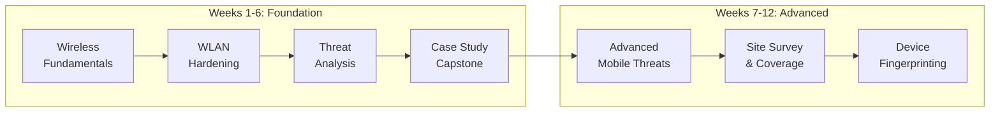
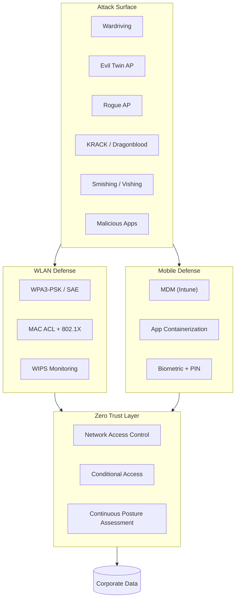
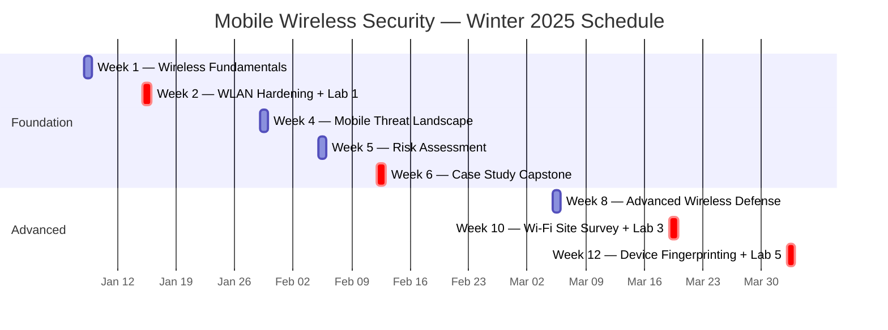

# Mobile Wireless Security — WLAN Defense & Mobile Device Security

> Ross Moravec | Cambrian College | CSC-7306 Mobile Wireless Security | Winter 2025 | Instructor: Mohamed Jbeili
> 12-week term (8 instructor-led sessions): 3 hands-on labs, 1 capstone case study (WLAN & Mobile Security Plan), 6 wireless + 6 mobile threats analyzed.

## Quick Links

| Resource | Description |
|----------|-------------|
| [WEEKLY_TOPIC_MAP.md](WEEKLY_TOPIC_MAP.md) | 12-week curriculum with topics, labs, and skills per week |
| [WEEKLY_LABS_SUMMARY.md](WEEKLY_LABS_SUMMARY.md) | Lab-by-lab progressive portfolio (Lab 1 → Lab 3 → Lab 5) |
| [CASE_STUDY_CAPSTONE.md](CASE_STUDY_CAPSTONE.md) | Capstone: Bluegreen Media WLAN & Mobile Security Plan |
| [CYBER_KILL_CHAIN_ANALYSIS.md](CYBER_KILL_CHAIN_ANALYSIS.md) | Cyber Kill Chain applied to wireless/mobile attacks |
| [WIRELESS_THREAT_MODEL.md](WIRELESS_THREAT_MODEL.md) | WLAN + mobile threat taxonomy with STRIDE classification |
| [BYOD_POLICY_FRAMEWORK.md](BYOD_POLICY_FRAMEWORK.md) | BYOD/MDM/NAC/Zero Trust synthesis and decision matrix |
| [EVIDENCE_INDEX.md](EVIDENCE_INDEX.md) | Screenshots index by week/topic |
| [assignments/](assignments/) | 3 lab submissions + 3 capstone deliverables (PDFs) |

## Course Overview

This course delivered hands-on competency in **wireless network security and mobile device security** through the Jones & Bartlett Learning *Wireless and Mobile Device Security, Second Edition* curriculum. Starting from wireless fundamentals, the course progressively built a complete defensive architecture:

## Wireless & Mobile Defense Architecture

Complete wireless attack surface and defensive control flow:

## 12-Week Curriculum Map

## Lab Portfolio Highlights

### Lab 1 — Securing a Wireless Network from Wardriving Attacks (Week 2)

Hands-on hardening of an open WLAN using GHostAPd web GUI. Migrated from "Security: None" configuration to WPA2-PSK + MAC ACL enforcement. Verified defensive posture using LinSSID to scan neighboring WLANs (`simplewifi`, `notsosimplewifi`) and confirm encryption mode and channel distribution.

**Skills:** GHostAPd configuration · SSID/channel/transmit power tuning · WPA2-PSK passphrase enforcement · MAC address filtering (Default Deny + allow list) · LinSSID scanning · Association log analysis.

**Submission:** [`Lab01_Wireless_Wardriving_Defense_Submission.pdf`](assignments/Lab01_Wireless_Wardriving_Defense_Submission.pdf)

### Lab 3 — Conducting a Wi-Fi Site Survey (Week 10)

Professional site survey methodology: generated signal-level heatmaps, analyzed SIR (signal-to-interference ratio), classified PHY modes, and identified interference sources. Mapped dead zones using multi-AP coverage analysis across 2.4 GHz and 5 GHz bands.

**Skills:** Heatmap generation · Signal-level analysis · SIR calculation · PHY mode identification (802.11n vs 802.11ac) · Dead zone detection · Multi-band frequency analysis · Interference source triangulation.

**Submission:** [`Lab03_WiFi_Site_Survey_Submission.pdf`](assignments/Lab03_WiFi_Site_Survey_Submission.pdf)

### Lab 5 — Fingerprinting Mobile Devices (Week 12)

Passive and active device fingerprinting across multiple tools. Compared Wireshark + p0f (passive) vs Nmap + ClientJS (active) approaches. Analyzed User-Agent strings across Chrome/Firefox/Edge on Android and Windows to understand browser/OS fingerprinting signatures.

**Skills:** Passive fingerprinting (Wireshark, p0f) · Active fingerprinting (Nmap -O, ClientJS) · TTL field analysis · User-Agent string comparison · OS detection (Android 9.x identification) · Detection-evasion tradeoffs.

**Submission:** [`Lab05_Mobile_Device_Fingerprinting_Submission.pdf`](assignments/Lab05_Mobile_Device_Fingerprinting_Submission.pdf)

## Capstone Case Study — Bluegreen Media WLAN & Mobile Security Plan (Week 6)

A comprehensive 3-part security plan for a fictional 60-employee social media company (Bluegreen Media) considering an IPO. The case study integrates vulnerability analysis, audit planning, risk assessment, BYOD policy design, and three strategic security recommendations (NAC, MDM+Zero Trust, WIPS).

**Deliverables:**

- Part 1: WLAN & Mobile Vulnerability Analysis Plan (Rogue APs, Evil Twin, WPA2/WPA3 exploits, malicious apps, smishing, cloud data leakage)
- Part 2: Audit & Risk Assessment Plan (NIST SP 800-30, ISO 27005, STRIDE/PASTA threat modeling)
- Part 3: BYOD Policy Framework + 3 Strategic Security Recommendations

**Skills:** Vulnerability analysis methodology · Audit procedure design · NIST/ISO risk frameworks · BYOD policy tiering · NAC architecture (Cisco ISE, Aruba ClearPass, Forescout) · MDM + Zero Trust integration (Microsoft Intune) · Wireless Intrusion Prevention (WIPS).

**Details:** [CASE_STUDY_CAPSTONE.md](CASE_STUDY_CAPSTONE.md)
**Submissions:** [Case Study Plan](assignments/CaseStudy_WLAN_Mobile_Security_Plan.pdf) · [Kill Chain Quiz Evidence](assignments/CyberKillChain_Quiz_Evidence.pdf) · [Presentation](assignments/CaseStudy_Final_Presentation.pdf)

## Skills Demonstrated

| Domain | Technologies & Frameworks |
|--------|---------------------------|
| **WLAN Security Architecture** | WPA2/WPA3, 802.1X, EAP, WPS, PMF, SAE, CCMP, GHostAPd |
| **Wireless Threat Analysis** | Wardriving, Evil Twin, Rogue AP, Deauth, KRACK, Dragonblood |
| **Site Survey & Coverage** | Heatmaps, SIR analysis, 802.11 PHY modes, dead zone detection |
| **Mobile Device Security** | Android/iOS hardening, jailbreak/root detection, biometric auth |
| **Device Fingerprinting** | Wireshark passive, p0f, Nmap active, ClientJS, User-Agent analysis |
| **BYOD/MDM** | Microsoft Intune, app containerization, selective wipe, MAM |
| **Network Access Control** | Cisco ISE, Aruba ClearPass, Forescout, 802.1X + RADIUS, dynamic VLAN |
| **Zero Trust** | Continuous device posture, conditional access, context-aware policies |
| **Threat Modeling** | STRIDE, PASTA, MITRE ATT&CK Mobile Matrix |
| **Risk Frameworks** | NIST SP 800-30, NIST SP 800-153, NIST SP 800-124r2, ISO 27005 |

## Certification Alignment

This course maps directly to the **CWSP (Certified Wireless Security Professional)** certification from CWNP. The course content aligns with all six CWSP exam domains:

| CWSP Domain | Weight | Course Coverage |
|---|---|---|
| Security Policy | 10% | Case Study Part 3 (BYOD policy framework, acceptable use, compliance) |
| Vulnerabilities, Threats, and Attacks | 30% | Weeks 1-2, 4; Case Study Part 1 (6 WLAN + 6 mobile threats analyzed) |
| WLAN Security Design and Architecture | 20% | Week 2 (Lab 1); Case Study Part 3 (3 strategic recommendations) |
| Security Lifecycle Management | 20% | Week 5; Case Study Part 2 (audit + risk assessment) |
| WLAN Monitoring and Management | 10% | Week 10 (Lab 3); Case Study Rec #3 (WIPS) |
| Deploying Fast Secure Roaming | 10% | Week 8 coverage (802.11r/k/v concepts) |

## Architecture Principles

_See [Architecture Principles](../../../README.md#architecture-principles) in the portfolio landing page for the three wireless security design principles applied throughout this work._

## References

### Core Frameworks & Standards

- [NIST SP 800-153 — Guidelines for Securing WLANs](https://csrc.nist.gov/publications/detail/sp/800-153/final)
- [NIST SP 800-124r2 — Guidelines for Managing Mobile Device Security](https://csrc.nist.gov/publications/detail/sp/800-124/rev-2/final)
- [NIST SP 800-30 — Guide for Conducting Risk Assessments](https://csrc.nist.gov/publications/detail/sp/800-30/rev-1/final)
- [IEEE 802.11 Wireless Standards](https://standards.ieee.org/ieee/802.11/7028/)
- [Wi-Fi Alliance WPA3 Specification](https://www.wi-fi.org/discover-wi-fi/security)

### Threat Intelligence

- [MITRE ATT&CK Mobile Matrix](https://attack.mitre.org/matrices/mobile/)
- [OWASP Mobile Application Security (MASVS)](https://mas.owasp.org/)
- [Lockheed Martin Cyber Kill Chain](https://www.lockheedmartin.com/en-us/capabilities/cyber/cyber-kill-chain.html)

### Certifications

- [CWNP CWSP — Certified Wireless Security Professional](https://www.cwnp.com/certifications/cwsp)

---

*Ross Moravec | Mobile Wireless Security Portfolio | CSC-7306 Winter 2025*
