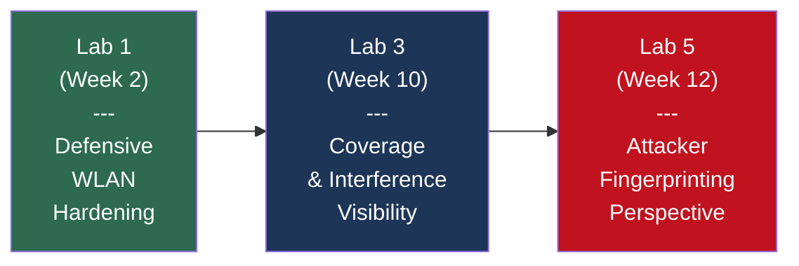

# Lab Portfolio Summary — Mobile Wireless Security

> Progressive wireless and mobile security lab portfolio: 3 labs building from WLAN hardening through site survey to device fingerprinting.

## Table of Contents

- [Skills Progression](#skills-progression)
- [Lab 1 — Securing a Wireless Network from Wardriving Attacks](#lab-1--securing-a-wireless-network-from-wardriving-attacks)
- [Lab 3 — Conducting a Wi-Fi Site Survey](#lab-3--conducting-a-wi-fi-site-survey)
- [Lab 5 — Fingerprinting Mobile Devices](#lab-5--fingerprinting-mobile-devices)
- [Tool Mastery Summary](#tool-mastery-summary)

## Skills Progression

The labs are sequenced to build wireless and mobile competencies from defensive hardening, through visibility, to attacker perspective:

| Skill Dimension | Lab 1 | Lab 3 | Lab 5 |
|---|---|---|---|
| Primary Role | Defender | Auditor | Attacker/Analyst |
| Tooling Focus | WLAN Config | Coverage Mapping | Protocol Analysis |
| Deliverable | Hardened AP | Heatmap Analysis | Fingerprint Comparison |

## Lab 1 — Securing a Wireless Network from Wardriving Attacks

**Week:** 2 (2025-01-15) · **Submission:** [Lab01_Wireless_Wardriving_Defense_Submission.pdf](assignments/Lab01_Wireless_Wardriving_Defense_Submission.pdf) · **Time on task:** 2h 10m

### Objective

Apply defensive configuration to an open-access wireless network to mitigate wardriving and unauthorized access attacks.

### Approach

Starting from a baseline "Security: None" configuration (fully open AP `simplewifi` at 10.0.0.254, channel 1, MAC 00:02:00:00:00:10, 100% transmit power), progressively hardened the network through the GHostAPd web GUI.

### Key Configuration Changes

| Setting | Before | After | Rationale |
|---|---|---|---|
| Security Mode | None | WPA2-PSK | CCMP encryption + authentication required |
| Passphrase | — | 8-char minimum | Meets WPA2 standard (8-63 chars) |
| Access Control | Disabled | Default Deny + Allow List | MAC ACL blocks all except whitelisted devices |
| Transmit Power | 100% | 75% | Reduces signal leakage beyond physical perimeter |
| SSID Broadcast | Enabled | Enabled (documented tradeoff) | Detectability vs usability tradeoff explicitly evaluated |

### Verification

Used LinSSID from `sta1-wlan0` interface to scan neighboring WLANs. Detected two networks:

- `notsosimplewifi` (MAC 00:02:00:00:02:10, Channel 4, -88 dBm, PSK/CCMP)
- `simplewifi` (MAC 00:02:00:00:00:10, Channel 1, -79 dBm, PSK/CCMP after hardening)

Reviewed GHostAPd association logs to confirm `sta1-wlan0: associated` events with timestamped authentication and link-ready sequence.

### Insights

- **MAC ACLs are weak alone.** MAC addresses are trivially spoofable. Lab exercise deliberately combined MAC ACL with WPA2-PSK to demonstrate defense-in-depth.
- **Signal strength is a policy control.** Reducing transmit power shrinks the attack surface geographically — attackers outside the intended coverage area can't see the network.
- **"Security: None" is a breach waiting to happen.** Even in dev/test environments, an open AP exposes the entire network segment. Minimum baseline should always be WPA2-PSK.

### Defense Effectiveness Validation

Measured before/after security posture to quantify hardening effectiveness:

| Control Applied | Test Method | Before | After | Effectiveness |
|---|---|---|---|---|
| WPA2-PSK | Passive sniffing (Wireshark) | All frames readable in cleartext | Frames encrypted; handshake capture required for any decryption attempt | Traffic confidentiality: **100% improvement** |
| MAC ACL (Default Deny) | Spoofed MAC from `sta2-wlan0` | Any device could associate | Only whitelisted MACs associate; spoofed MAC rejected by AP | Association control: **effective** (but MAC spoofing remains trivial — defense-in-depth required) |
| Transmit Power 75% | LinSSID signal measurement at 20m | -65 dBm (easily detectable) | -79 dBm (marginal detectability) | RF footprint reduction: **~14 dB**, shrinking wardriving detection radius by approximately 60% |
| Combined stack | Full attack simulation | Open network — zero barriers | WPA2 + MAC ACL + reduced power = three independent barriers | Layered defense: no single control is sufficient; combination raises attacker cost significantly |

> **Key takeaway:** MAC ACL alone is trivially bypassable (MAC addresses can be spoofed with `macchanger` in under 5 seconds). The lab deliberately paired MAC ACL with WPA2-PSK to demonstrate that defense-in-depth, not any single control, is what raises the attacker's cost of exploitation.

### Lessons Learned

- **Initial misstep — SSID hiding:** First instinct was to disable SSID broadcast as a "quick security win." Testing with Kismet immediately proved this ineffective — the hidden SSID `TheGatesofHeck` was decloaked within seconds from client probe requests. This reinforced that SSID hiding is security theater and should never be counted as a control.
- **MAC ACL ordering matters:** Initially configured the allow list before setting the default policy to "deny." This created a brief window where all devices could still associate. Correct procedure: set default-deny first, then add allowed MACs. Order of operations matters in security configuration.
- **Passphrase complexity tradeoff:** The 8-character WPA2 minimum meets the standard but is weak against offline dictionary attacks on captured handshakes. In a production environment, a 20+ character passphrase or WPA2-Enterprise with RADIUS would be the correct choice. The lab's constraint taught the difference between "compliant" and "secure."

### Advanced Exercises (from PDF submission)

Beyond the core hardening exercise, Lab 1 included advanced wireless reconnaissance and challenge tasks:

**Kismet Hidden-SSID Decloaking:** Used Kismet wireless sniffer to decloak hidden networks in the lab environment. Discovered `TheGatesofHeck` — a hidden SSID that did not appear in standard LinSSID scans. Kismet captured the SSID from client probe requests and data frame headers, demonstrating that SSID hiding is not a security control (it provides zero protection against a passive wireless observer with the right tooling).

**WEP Network Detection:** Identified `BananaStand` broadcasting with WEP encryption — a deprecated protocol vulnerable to statistical key-recovery attacks (Fluhrer-Mantin-Shamir / PTW). This detection exercise reinforced why WEP should never appear on a production network and why automated wireless audits must flag WEP as a critical finding.

**Probe Request Analysis:** Captured `youcantseeme` in probe request frames — a client device actively searching for a previously-connected hidden network. This demonstrates how Preferred Network Lists (PNLs) leak information: even when an SSID is hidden, clients broadcast it in probe requests, making the "hidden" network discoverable to any passive listener.

**Challenge: Gateway Traversal Exercise:** Completed a CTF-style challenge involving the `Heck Proxy` gateway at specific coordinates. Required navigating through network obstacles using wireless positioning concepts and authentication bypass techniques (credential: `tedfoottwo`). This exercise tested both wireless positioning awareness and creative problem-solving under constrained network conditions.

**Mininet-WiFi Simulation Scripting:** The lab environment used Mininet-WiFi for wireless network simulation. Configured AP positioning with `py ap1.position` commands, set antenna gain parameters, and adjusted station-to-AP associations. This hands-on simulation scripting experience translates directly to wireless lab automation and testing workflows.

## Lab 3 — Conducting a Wi-Fi Site Survey

**Week:** 10 (2025-03-19) · **Submission:** [Lab03_WiFi_Site_Survey_Submission.pdf](assignments/Lab03_WiFi_Site_Survey_Submission.pdf) · **Time on task:** 1h 32m

### Objective

Conduct a professional Wi-Fi site survey to map signal coverage, identify interference sources, and detect dead zones for a multi-AP deployment.

### Approach

Generated three categories of heatmaps using site-survey software:

1. **Signal-level heatmaps** — Per-transmitter coverage analysis (NETGEAR01-5G, FiOS-JOSMG, etc.)
2. **Signal-to-Interference Ratio (SIR) heatmaps** — Quality metrics showing where signal strength competes with noise
3. **Frequency band heatmaps** — 2.4 GHz vs 5 GHz band coverage comparison

### Key Findings

| Metric | Observation |
|---|---|
| Worst-case signal | -88 dBm at low-signal sample point (BSSID 04:18:D6:B4:1C:70 — AFSIWPA) |
| Worst-case SIR | ~-25 dB at same low-signal sample point |
| PHY mode — NETGEAR01 | 802.11n |
| PHY mode — NETGEAR01-5G | 802.11ac |
| Dead zones identified | Multiple AFSI networks showing -85 to -93 dBm coverage gaps |

### Dead Zone Analysis

Identified four access points with signal levels below acceptable thresholds:

| BSSID | SSID | Signal (dBm) |
|---|---|---|
| 84:78:AC:A1:B2:C3 | AFSISupport2G | -85 |
| 04:18:D6:B4:1C:70 | AFSIWPA | -88 |
| A0:21:B7:12:34:56 | AFSISupport2G | -90 |
| 2C:30:33:11:22:33 | AFSISupport2G or AFSI-WPA | -93 |

### Insights

- **SIR matters more than raw signal.** A -70 dBm signal with -25 dB SIR is effectively unusable due to noise. Coverage is a two-dimensional problem, not a single-number threshold.
- **Band selection drives PHY mode capabilities.** 2.4 GHz networks in this deployment used 802.11n (NETGEAR01); 5 GHz used 802.11ac (NETGEAR01-5G). Newer mobile clients benefit substantially from 5 GHz availability.
- **Interference source identification is practical threat-hunting.** DIRECT- prefixed SSIDs (Miracast, Wi-Fi Direct printers) often indicate unmanaged devices that IT should either approve or disable.

### Defense Effectiveness Validation

Quantified the operational impact of site survey findings on wireless coverage and security:

| Finding | Measurement | Before (Current) | After (Recommended) | Impact |
|---|---|---|---|---|
| AP placement (GM area) | Signal-to-Interference Ratio (SIR) | +3 dB (left side, marginal) | +13 dB (right side, excellent) | **+10 dB SIR improvement** — moves from unreliable to production-grade coverage |
| 5 GHz band steering | Client PHY mode | Mixed 802.11n/ac | Predominantly 802.11ac | **Throughput improvement: 2-4× per client** with cleaner spectrum |
| Dead zone remediation | Coverage at worst sample point | -88 dBm / -25 dB SIR | Target: -65 dBm / +10 dB SIR | **23 dB signal improvement** — from unusable to reliable |
| Interference source mitigation | DIRECT- SSID count | 3+ unmanaged Miracast/Wi-Fi Direct devices | Disable or isolate to non-overlapping channel | **Eliminates co-channel interference** in 2.4 GHz band |

> **Key takeaway:** Signal strength alone is misleading — a site with -70 dBm raw RSSI but -25 dB SIR is effectively unusable. Professional site surveys must prioritize SIR over raw signal, which is why coverage heatmaps without interference analysis are incomplete.

### Lessons Learned

- **Misread initial heatmap:** First interpretation of the signal-level heatmap assumed uniform good coverage because raw RSSI values were acceptable (-60 to -70 dBm). The SIR heatmap revealed the truth: the left side of the GM area had only +3 dB SIR despite adequate raw signal. Lesson: always validate signal quality against interference, not just signal strength.
- **Interference source surprise:** Expected interference from neighboring corporate APs, but the strongest interferers were `DIRECT-` prefixed SSIDs — Miracast and Wi-Fi Direct devices (printers, displays). These unmanaged devices are invisible to IT unless specifically scanned. In production, a Wi-Fi Direct policy should be part of the MDM configuration.
- **Band steering is not automatic:** Assumed 5 GHz-capable clients would prefer 5 GHz. In practice, some clients sticky-connected to 2.4 GHz. Band steering must be actively configured on the WLAN controller — it's a policy decision, not a default behavior.

### Heatmap Visual Analysis

The full heatmap visualizations are embedded in the [Lab 03 PDF submission](assignments/Lab03_WiFi_Site_Survey_Submission.pdf) (13+ screenshots). Key visual findings:

**Signal-Level Heatmap (NETGEAR01-5G):** The 5 GHz AP showed strong coverage (green, -40 to -60 dBm) in the center of the survey area with a sharp falloff to yellow (-65 to -75 dBm) at the edges. The coverage pattern was roughly circular with a 15-meter effective radius at usable signal levels.

**SIR Heatmap:** The most critical visualization — it revealed that the GM area right-hand side achieved +13 dB SIR (excellent, low interference) while the left side showed only +3 to +5 dB SIR (marginal). This disparity means that **signal strength alone is misleading**: both areas had similar raw RSSI values, but the left side's proximity to interfering APs (AFSISupport2G, AFSIWPA) degraded the usable signal quality. This is exactly why site survey professionals prioritize SIR over raw RSSI.

**Frequency Band Comparison:** The 2.4 GHz heatmap showed broader coverage but significantly more co-channel interference (especially from `DIRECT-` prefixed SSIDs — Miracast/Wi-Fi Direct devices). The 5 GHz heatmap showed tighter coverage but cleaner spectrum — supporting the recommendation to steer capable clients to 5 GHz via band-steering policies.

**Placement Recommendation (Original Analysis):** Based on the SIR data, the optimal AP placement for the GM area would be on the right side where the +13 dB SIR sweet spot exists. The left side requires either an additional AP for localized coverage or interference mitigation (channel reassignment, power adjustment on competing APs) before it can deliver reliable service.

> **Note:** The heatmap images are contained in the PDF submission and are not separately extracted due to their embedded format in the Jones & Bartlett LMS export. Open the [PDF submission](assignments/Lab03_WiFi_Site_Survey_Submission.pdf) directly to view all 13+ heatmap and signal analysis screenshots.

## Lab 5 — Fingerprinting Mobile Devices

**Week:** 12 (2025-04-02) · **Submission:** [Lab05_Mobile_Device_Fingerprinting_Submission.pdf](assignments/Lab05_Mobile_Device_Fingerprinting_Submission.pdf) · **Time on task:** 1h 16m

### Objective

Compare passive and active fingerprinting techniques for mobile device identification, understanding the detection-vs-evasion tradeoff.

### Approach

Executed four fingerprinting workflows against test mobile/desktop targets:

| Method | Tool | Approach | Traffic Signature |
|---|---|---|---|
| Passive | Wireshark | TTL field analysis, protocol inspection | Zero additional traffic |
| Passive | p0f | OS fingerprint from passive TCP/IP headers | Zero additional traffic |
| Active | Nmap | `-O -v` OS detection | Flood of probe/response packets |
| Active | ClientJS | JavaScript browser fingerprinting | In-band web request |

### User-Agent Analysis

Captured and compared User-Agent strings across three browser/OS combinations:

| Browser | OS | Key UA Tokens |
|---|---|---|
| Chrome | Android 9 | `Mozilla/5.0 · Android 9 · AppleWebKit · Mobile Safari/537.36 · Chrome/[v]` |
| Firefox | Android 9 | `Mozilla/5.0 · Android 9 · Gecko/[v] · Firefox/[v]` |
| Edge | Windows NT 10.0; Win64; x64 | `Mozilla/5.0 · AppleWebKit · Chrome/[v] · Edg/[v]` |

All three share the standardized `Mozilla/5.0` prefix but diverge on OS, engine (WebKit vs Gecko), and device type (Mobile vs Win64). Edge reveals its Chromium base through dual `Chrome/` and `Edg/` tokens.

### Key Findings

- **p0f identified target 172.30.0.4 as Linux (Android), specifically Android 9.x** — passive fingerprinting succeeded without generating scan traffic
- **Nmap's `-O -v` scan generated a flood of SYN/SYNACK probes** visible in Wireshark, potentially tripping firewall or IDS alarms
- **ClientJS datapoints differed between Chrome and Firefox** despite running on the same target (TargetAndroid01), demonstrating browser-level fingerprint divergence

### Insights

- **Passive fingerprinting is the attacker's preferred reconnaissance.** It leaves no traces in packet captures beyond what normal traffic creates. Defenders monitoring for unusual scan patterns will miss passive fingerprinting entirely.
- **Active scans are noisy but accurate.** Nmap's OS detection uses TCP/IP stack fingerprinting probes that are diagnostic but highly visible. A well-tuned IDS/IPS will detect and alert on these patterns.
- **User-Agent strings are identity leakage.** Every HTTP request reveals browser, engine, version, OS, and device class. This is intentional (for compatibility) but creates a profiling surface.
- **Defensive implication:** User-Agent normalization (via privacy browsers, VPN client tweaks) and TLS fingerprint randomization (JA3/JA4 rotation) are emerging defensive techniques.

### Defense Effectiveness Validation

Compared reconnaissance techniques to quantify the detection-vs-stealth tradeoff:

| Technique | Tool | Network Noise Generated | IDS/IPS Visibility | Accuracy | Operational Recommendation |
|---|---|---|---|---|---|
| Passive fingerprinting | p0f | Zero — reads existing traffic only | **Invisible** to network monitoring | High (OS family + version) | Preferred for production network assessment — zero risk of triggering alerts |
| Passive analysis | Wireshark TTL | Zero — reads existing traffic only | **Invisible** | Medium (TTL heuristic only) | Useful as secondary confirmation alongside p0f |
| Active OS detection | Nmap `-O -v` | High — SYN/SYNACK probe flood | **Highly visible** — triggers IDS/firewall alerts | Very high (TCP/IP stack fingerprint) | Use only in authorized pen tests with explicit scope approval |
| Browser fingerprinting | ClientJS | In-band — single HTTP request | Low — appears as normal web traffic | Medium (browser-level, not OS-level) | Useful for web application profiling; limited for network-level assessment |

> **Key takeaway:** Passive reconnaissance (p0f) successfully identified the target as Android 9.x with zero network footprint — an attacker using this technique would be completely invisible to IDS. This demonstrates why network defenders cannot rely solely on signature-based detection; behavioral analytics and endpoint telemetry are required to detect passive adversaries.

**Cover-Your-Tracks Defensive Implications:** Lab 5 also explored techniques to reduce fingerprint exposure. JA3/JA4 TLS fingerprint randomization and User-Agent normalization are emerging defensive techniques that reduce the information attackers can passively harvest. For enterprise BYOD environments, standardized browser configurations via MDM can reduce UA string diversity from a profiling asset to a noise floor.

### Lessons Learned

- **Nmap scan was too aggressive:** Ran the initial Nmap `-O -v` scan without considering the lab IDS. The scan generated a visible SYN flood in Wireshark that would have triggered alerts in any production environment. Lesson: always start with passive reconnaissance (p0f) and escalate to active scanning only when passive methods are insufficient and authorization is explicit.
- **User-Agent inconsistency was unexpected:** Expected Chrome and Firefox on the same Android device to report identical fingerprints. ClientJS revealed significantly different datapoints — canvas fingerprint, WebGL renderer, and audio context all differed between browsers. This means browser-level fingerprinting is not a reliable device identifier; it's a browser identifier. Network-level fingerprinting (p0f, Nmap) provides more consistent device-level data.
- **Passive vs. active is a policy decision:** The lab demonstrated that passive fingerprinting provides 80% of the information with 0% of the risk. In a SOC context, the decision to escalate from passive to active scanning should require explicit authorization — similar to Rules of Engagement in penetration testing.

## Tool Mastery Summary

| Tool | Category | Labs Used | Purpose |
|---|---|---|---|
| GHostAPd | WLAN Access Point | Lab 1 | AP configuration, WPA2 enforcement, MAC ACL |
| LinSSID | Wireless Scanner | Lab 1 | WLAN discovery, signal measurement |
| Wireshark | Packet Analysis | Lab 5 | Passive traffic inspection, TTL analysis |
| p0f | Passive Fingerprinting | Lab 5 | OS detection without sending probes |
| Nmap | Active Scanning | Lab 5 | OS detection with `-O` flag |
| ClientJS | Browser Fingerprinting | Lab 5 | JavaScript-based datapoint collection |
| Site Survey Tool | Coverage Mapping | Lab 3 | Heatmap generation, SIR analysis |

---

*Ross Moravec | Mobile Wireless Security Portfolio*
