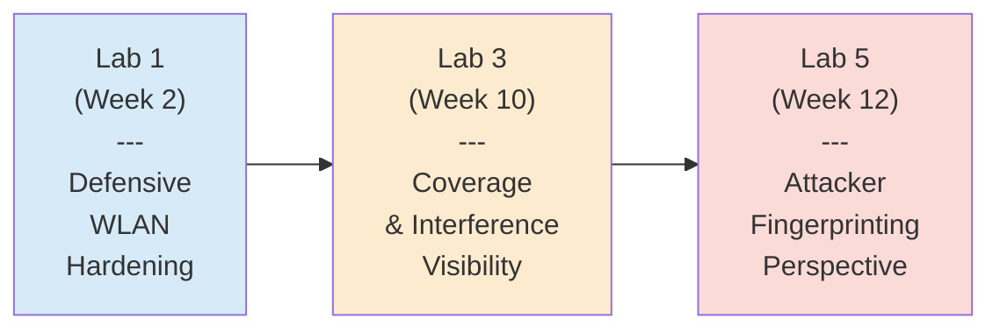

# Lab Portfolio Summary — Mobile Wireless Security

> Progressive wireless and mobile security lab portfolio: 3 labs building from WLAN hardening through site survey to device fingerprinting.

## Table of Contents

- [Skills Progression](#skills-progression)
- [Lab 1 — Securing a Wireless Network from Wardriving Attacks](#lab-1--securing-a-wireless-network-from-wardriving-attacks)
- [Lab 3 — Conducting a Wi-Fi Site Survey](#lab-3--conducting-a-wi-fi-site-survey)
- [Lab 5 — Fingerprinting Mobile Devices](#lab-5--fingerprinting-mobile-devices)
- [Tool Mastery Summary](#tool-mastery-summary)

## Skills Progression

The labs are sequenced to build wireless and mobile competencies from defensive hardening, through visibility, to attacker perspective:

| Skill Dimension | Lab 1 | Lab 3 | Lab 5 |
|---|---|---|---|
| Primary Role | Defender | Auditor | Attacker/Analyst |
| Tooling Focus | WLAN Config | Coverage Mapping | Protocol Analysis |
| Deliverable | Hardened AP | Heatmap Analysis | Fingerprint Comparison |

## Lab 1 — Securing a Wireless Network from Wardriving Attacks

**Week:** 2 (2025-01-15) · **Submission:** [Lab01_Wireless_Wardriving_Defense_Submission.pdf](assignments/Lab01_Wireless_Wardriving_Defense_Submission.pdf)

### Objective

Apply defensive configuration to an open-access wireless network to mitigate wardriving and unauthorized access attacks.

### Approach

Starting from a baseline "Security: None" configuration (fully open AP `simplewifi` at 10.0.0.254, channel 1, MAC 00:02:00:00:00:10, 100% transmit power), progressively hardened the network through the GHostAPd web GUI.

### Key Configuration Changes

| Setting | Before | After | Rationale |
|---|---|---|---|
| Security Mode | None | WPA2-PSK | CCMP encryption + authentication required |
| Passphrase | — | 8-char minimum | Meets WPA2 standard (8-63 chars) |
| Access Control | Disabled | Default Deny + Allow List | MAC ACL blocks all except whitelisted devices |
| Transmit Power | 100% | 75% | Reduces signal leakage beyond physical perimeter |
| SSID Broadcast | Enabled | Enabled (documented tradeoff) | Detectability vs usability tradeoff explicitly evaluated |

### Verification

Used LinSSID from `sta1-wlan0` interface to scan neighboring WLANs. Detected two networks:

- `notsosimplewifi` (MAC 00:02:00:00:02:10, Channel 4, -88 dBm, PSK/CCMP)
- `simplewifi` (MAC 00:02:00:00:00:10, Channel 1, -79 dBm, PSK/CCMP after hardening)

Reviewed GHostAPd association logs to confirm `sta1-wlan0: associated` events with timestamped authentication and link-ready sequence.

### Insights

- **MAC ACLs are weak alone.** MAC addresses are trivially spoofable. Lab exercise deliberately combined MAC ACL with WPA2-PSK to demonstrate defense-in-depth.
- **Signal strength is a policy control.** Reducing transmit power shrinks the attack surface geographically — attackers outside the intended coverage area can't see the network.
- **"Security: None" is a breach waiting to happen.** Even in dev/test environments, an open AP exposes the entire network segment. Minimum baseline should always be WPA2-PSK.

## Lab 3 — Conducting a Wi-Fi Site Survey

**Week:** 10 (2025-03-19) · **Submission:** [Lab03_WiFi_Site_Survey_Submission.pdf](assignments/Lab03_WiFi_Site_Survey_Submission.pdf) · **Time on task:** 1h 32m

### Objective

Conduct a professional Wi-Fi site survey to map signal coverage, identify interference sources, and detect dead zones for a multi-AP deployment.

### Approach

Generated three categories of heatmaps using site-survey software:

1. **Signal-level heatmaps** — Per-transmitter coverage analysis (NETGEAR01-5G, FiOS-JOSMG, etc.)
2. **Signal-to-Interference Ratio (SIR) heatmaps** — Quality metrics showing where signal strength competes with noise
3. **Frequency band heatmaps** — 2.4 GHz vs 5 GHz band coverage comparison

### Key Findings

| Metric | Observation |
|---|---|
| Worst-case signal | -88 dBm at low-signal sample point (BSSID 04:18:D6:B4:1C:70 — AFSIWPA) |
| Worst-case SIR | ~-25 dB at same low-signal sample point |
| PHY mode — NETGEAR01 | 802.11n |
| PHY mode — NETGEAR01-5G | 802.11ac |
| Dead zones identified | Multiple AFSI networks showing -85 to -93 dBm coverage gaps |

### Dead Zone Analysis

Identified four access points with signal levels below acceptable thresholds:

| BSSID | SSID | Signal (dBm) |
|---|---|---|
| 84:78:AC:A1:B2:C3 | AFSISupport2G | -85 |
| 04:18:D6:B4:1C:70 | AFSIWPA | -88 |
| A0:21:B7:12:34:56 | AFSISupport2G | -90 |
| 2C:30:33:11:22:33 | AFSISupport2G or AFSI-WPA | -93 |

### Insights

- **SIR matters more than raw signal.** A -70 dBm signal with -25 dB SIR is effectively unusable due to noise. Coverage is a two-dimensional problem, not a single-number threshold.
- **Band selection drives PHY mode capabilities.** 2.4 GHz networks in this deployment used 802.11n (NETGEAR01); 5 GHz used 802.11ac (NETGEAR01-5G). Newer mobile clients benefit substantially from 5 GHz availability.
- **Interference source identification is practical threat-hunting.** DIRECT- prefixed SSIDs (Miracast, Wi-Fi Direct printers) often indicate unmanaged devices that IT should either approve or disable.

## Lab 5 — Fingerprinting Mobile Devices

**Week:** 12 (2025-04-02) · **Submission:** [Lab05_Mobile_Device_Fingerprinting_Submission.pdf](assignments/Lab05_Mobile_Device_Fingerprinting_Submission.pdf) · **Time on task:** 1h 16m

### Objective

Compare passive and active fingerprinting techniques for mobile device identification, understanding the detection-vs-evasion tradeoff.

### Approach

Executed four fingerprinting workflows against test mobile/desktop targets:

| Method | Tool | Approach | Traffic Signature |
|---|---|---|---|
| Passive | Wireshark | TTL field analysis, protocol inspection | Zero additional traffic |
| Passive | p0f | OS fingerprint from passive TCP/IP headers | Zero additional traffic |
| Active | Nmap | `-O -v` OS detection | Flood of probe/response packets |
| Active | ClientJS | JavaScript browser fingerprinting | In-band web request |

### User-Agent Analysis

Captured and compared User-Agent strings across three browser/OS combinations:

| Browser | OS | Key UA Tokens |
|---|---|---|
| Chrome | Android 9 | `Mozilla/5.0 · Android 9 · AppleWebKit · Mobile Safari/537.36 · Chrome/[v]` |
| Firefox | Android 9 | `Mozilla/5.0 · Android 9 · Gecko/[v] · Firefox/[v]` |
| Edge | Windows NT 10.0; Win64; x64 | `Mozilla/5.0 · AppleWebKit · Chrome/[v] · Edg/[v]` |

All three share the standardized `Mozilla/5.0` prefix but diverge on OS, engine (WebKit vs Gecko), and device type (Mobile vs Win64). Edge reveals its Chromium base through dual `Chrome/` and `Edg/` tokens.

### Key Findings

- **p0f identified target 172.30.0.4 as Linux (Android), specifically Android 9.x** — passive fingerprinting succeeded without generating scan traffic
- **Nmap's `-O -v` scan generated a flood of SYN/SYNACK probes** visible in Wireshark, potentially tripping firewall or IDS alarms
- **ClientJS datapoints differed between Chrome and Firefox** despite running on the same target (TargetAndroid01), demonstrating browser-level fingerprint divergence

### Insights

- **Passive fingerprinting is the attacker's preferred reconnaissance.** It leaves no traces in packet captures beyond what normal traffic creates. Defenders monitoring for unusual scan patterns will miss passive fingerprinting entirely.
- **Active scans are noisy but accurate.** Nmap's OS detection uses TCP/IP stack fingerprinting probes that are diagnostic but highly visible. A well-tuned IDS/IPS will detect and alert on these patterns.
- **User-Agent strings are identity leakage.** Every HTTP request reveals browser, engine, version, OS, and device class. This is intentional (for compatibility) but creates a profiling surface.
- **Defensive implication:** User-Agent normalization (via privacy browsers, VPN client tweaks) and TLS fingerprint randomization (JA3/JA4 rotation) are emerging defensive techniques.

## Tool Mastery Summary

| Tool | Category | Labs Used | Purpose |
|---|---|---|---|
| GHostAPd | WLAN Access Point | Lab 1 | AP configuration, WPA2 enforcement, MAC ACL |
| LinSSID | Wireless Scanner | Lab 1 | WLAN discovery, signal measurement |
| Wireshark | Packet Analysis | Lab 5 | Passive traffic inspection, TTL analysis |
| p0f | Passive Fingerprinting | Lab 5 | OS detection without sending probes |
| Nmap | Active Scanning | Lab 5 | OS detection with `-O` flag |
| ClientJS | Browser Fingerprinting | Lab 5 | JavaScript-based datapoint collection |
| Site Survey Tool | Coverage Mapping | Lab 3 | Heatmap generation, SIR analysis |

---

*Ross Moravec | Mobile Wireless Security Portfolio*
