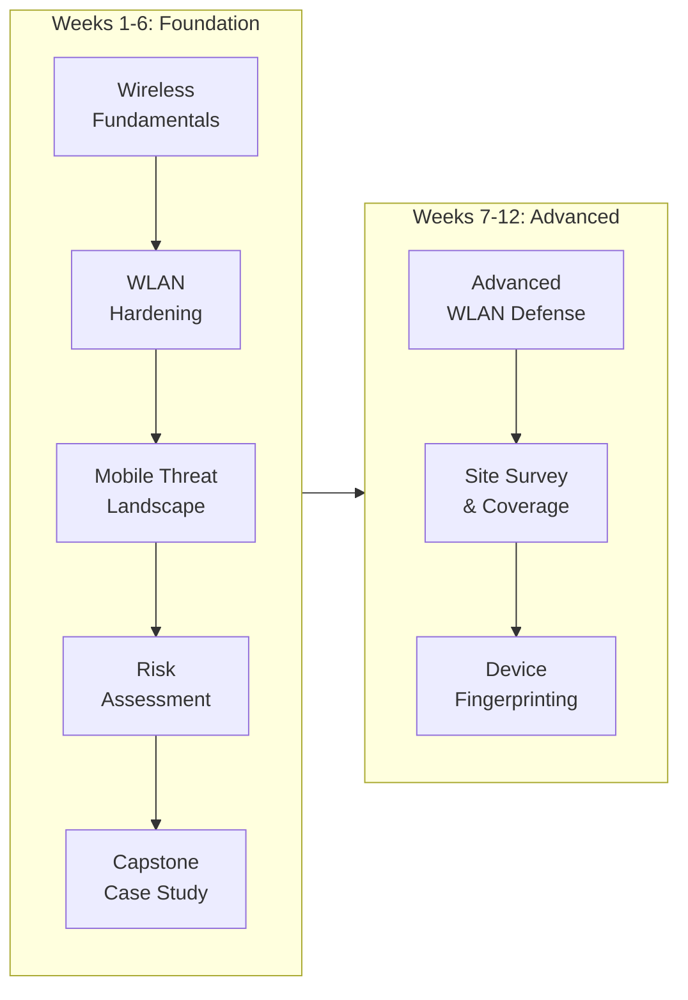

# 12-Week Curriculum Map — Mobile Wireless Security (CSC-7306)

> 12-week curriculum mapping for wireless network defense and mobile device security.

## Table of Contents

- [Curriculum Overview](#curriculum-overview)
- [Notes](#notes)
- [Topic Progression](#topic-progression)
- [Weekly Curriculum](#weekly-curriculum)
- [Evidence Cross-Reference](#evidence-cross-reference)

## Curriculum Overview

| Week | Date | Topic | Lab/Assessment | Key Skills |
|------|------|-------|----------------|------------|
| 1 | 2025-01-08 | Wireless Fundamentals & Course Introduction | — | IEEE 802.11 standards, WLAN architecture, RF basics |
| 2 | 2025-01-15 | WLAN Hardening & Wardriving Defense | [Lab 1](assignments/Lab01_Wireless_Wardriving_Defense_Submission.pdf) | GHostAPd config, WPA2-PSK, MAC ACL, LinSSID scanning |
| 3 | 2025-01-22 | (No session recorded) | — | — |
| 4 | 2025-01-29 | Mobile Threat Landscape | — | Malicious apps, smishing, jailbreak risks, BYOD exposure |
| 5 | 2025-02-05 | Risk Assessment & Security Controls | — | NIST SP 800-30, ISO 27005, STRIDE/PASTA |
| 6 | 2025-02-12 | Capstone: WLAN & Mobile Security Plan | [Case Study](assignments/CaseStudy_WLAN_Mobile_Security_Plan.pdf) + [Kill Chain](assignments/CaseStudy_Cyber_Kill_Chain_Analysis.pdf) + [Presentation](assignments/CaseStudy_Final_Presentation.pdf) | Vulnerability analysis, audit planning, BYOD policy, NAC/MDM/WIPS design |
| 7 | 2025-02-19 | (Reading week / no session) | — | — |
| 8 | 2025-03-05 | Advanced Wireless Defense | — | WPA3-SAE, PMF, 802.11w, WIPS, rogue AP containment |
| 9 | 2025-03-12 | (No session recorded) | — | — |
| 10 | 2025-03-19 | Wi-Fi Site Survey & Coverage Planning | [Lab 3](assignments/Lab03_WiFi_Site_Survey_Submission.pdf) | Heatmap generation, SIR analysis, 802.11 PHY modes, dead zone detection |
| 11 | 2025-03-26 | (No session recorded) | — | — |
| 12 | 2025-04-02 | Mobile Device Fingerprinting | [Lab 5](assignments/Lab05_Mobile_Device_Fingerprinting_Submission.pdf) | Wireshark passive, p0f, Nmap -O, ClientJS, User-Agent analysis |

## Notes

- **Lab numbering:** Labs follow Jones & Bartlett Learning *Wireless and Mobile Device Security, Second Edition* lab numbering (1, 3, 5). Labs 2, 4, and 6 were not assigned in this section; gaps reflect instructor curriculum choices, not missing work.
- **Case Study timing:** Week 6 case study is a mid-course capstone. It synthesizes Weeks 1-5 into a comprehensive WLAN & Mobile Security Plan for a fictional company (Bluegreen Media).
- **Cyber Kill Chain:** Week 6 deliverable includes two supplementary quizzes (Cyber Kill Chain Part 1, Networking Concepts Part 2) completed Jan 26th, 2025.
- **Lecture recordings:** Instructor-recorded lectures (Weeks 1, 2, 4, 5, 6, 8) are instructor IP and are not redistributed in this public portfolio.
- **Instruction PDFs:** Jones & Bartlett Learning lab instruction PDFs are copyrighted course materials and are not included in this portfolio (per fair-use/redistribution policy).

## Topic Progression

## Weekly Curriculum

### Foundation (Weeks 1-6)

**Week 1 — Wireless Fundamentals (2025-01-08)**

Course introduction and wireless networking fundamentals. Covered IEEE 802.11 family of standards, OSI layers applicable to wireless, basic RF concepts (channels, frequencies, signal propagation), WLAN architecture (infrastructure vs ad-hoc), and introduction to wireless security concepts (authentication, encryption, integrity).

**Week 2 — WLAN Hardening & Wardriving Defense (2025-01-15) — Lab 1**

Hands-on WLAN security configuration. Starting from an open-access baseline, progressively applied security controls: SSID broadcast settings, channel selection, transmit power tuning, WPA2-PSK encryption with compliant passphrase length (8-63 chars), CCMP encryption, and MAC ACL filtering (Default Deny + allow list). Verified defenses via LinSSID scanning and GHostAPd association logs.

**Week 4 — Mobile Threat Landscape (2025-01-29)**

Survey of mobile-specific threat vectors: trojanized applications, enterprise-targeted spyware, SMS phishing (smishing), voice phishing (vishing), QR code phishing, and cloud data leakage through insecure APIs and personal cloud storage. Examined the BYOD amplification effect on these threats.

**Week 5 — Risk Assessment & Security Controls (2025-02-05)**

Formal risk assessment methodology. Covered NIST SP 800-30 (Guide for Conducting Risk Assessments), ISO 27005, and threat modeling frameworks (STRIDE, PASTA). Discussed quantitative vs qualitative risk scoring, key risk indicators (KRIs), risk treatment options (mitigate, transfer, accept, avoid), and continuous monitoring integration.

**Week 6 — Capstone Case Study (2025-02-12) — WLAN & Mobile Security Plan**

Comprehensive capstone applying Weeks 1-5 material to Bluegreen Media, a fictional 60-employee social media company considering an IPO. Deliverables included vulnerability analysis plan, audit & risk assessment plan, BYOD policy framework, and three strategic security recommendations (NAC, MDM+Zero Trust, WIPS). Final presentation synthesized findings into an executive-level deck.

### Advanced (Weeks 7-12)

**Week 8 — Advanced Wireless Defense (2025-03-05)**

Advanced WLAN defensive techniques: WPA3-SAE (Simultaneous Authentication of Equals), Protected Management Frames (PMF / 802.11w), Wireless Intrusion Prevention Systems (WIPS), rogue AP containment, deauthentication attack mitigation, and 802.11r/k/v fast secure roaming.

**Week 10 — Wi-Fi Site Survey & Coverage Planning (2025-03-19) — Lab 3**

Professional wireless site survey methodology. Generated signal-level heatmaps for multiple access points (NETGEAR01-5G and others), analyzed Signal-to-Interference Ratio (SIR), identified 802.11 PHY modes (n vs ac), detected dead zones, and mapped interference sources across 2.4 GHz and 5 GHz frequency bands. Captured BSSID signal measurements down to -88 dBm with corresponding SIR values.

**Week 12 — Mobile Device Fingerprinting (2025-04-02) — Lab 5**

Comparative analysis of passive and active device fingerprinting techniques. Used Wireshark + p0f for passive fingerprinting (TTL analysis, User-Agent inspection, OS detection confirming Android 9.x), and Nmap + ClientJS for active fingerprinting (-O OS detection flag, browser datapoint comparison). Analyzed tradeoffs between detection evasiveness (passive) and identification accuracy (active).

## Evidence Cross-Reference

| Evidence Type | Location |
|--------------|----------|
| Lab submissions (PDF) | [assignments/](assignments/) |
| Capstone case study | [assignments/CaseStudy_WLAN_Mobile_Security_Plan.pdf](assignments/CaseStudy_WLAN_Mobile_Security_Plan.pdf) |
| Capstone presentation | [assignments/CaseStudy_Final_Presentation.pdf](assignments/CaseStudy_Final_Presentation.pdf) |
| Cyber Kill Chain quiz evidence | [assignments/CaseStudy_Cyber_Kill_Chain_Analysis.pdf](assignments/CaseStudy_Cyber_Kill_Chain_Analysis.pdf) |
| Narrative portfolio documents | [Course README](README.md) and linked portfolio docs |

---

*Ross Moravec | Mobile Wireless Security Portfolio*
