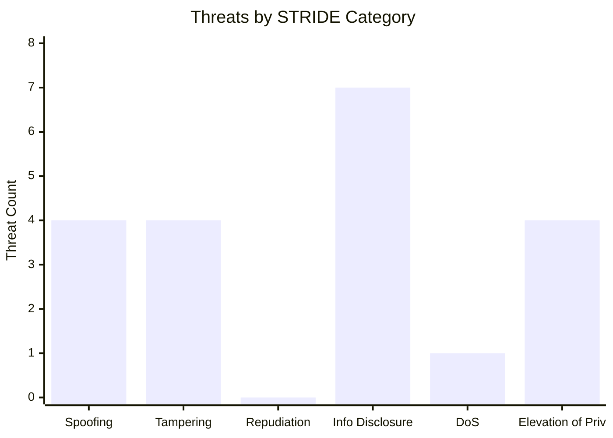
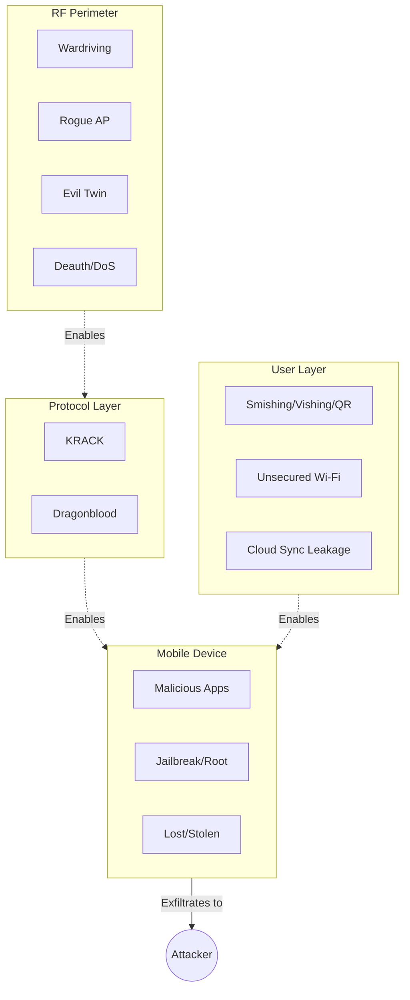

# Wireless & Mobile Threat Model

> Threat taxonomy covering the top 6 WLAN threats and top 6 mobile threats, with STRIDE categorization, MITRE ATT&CK Mobile mapping, and concrete mitigation controls.

## Table of Contents

- [Modeling Approach](#modeling-approach)
- [WLAN Threat Catalog](#wlan-threat-catalog)
- [Mobile Threat Catalog](#mobile-threat-catalog)
- [STRIDE Summary](#stride-summary)
- [Attack Surface Diagram](#attack-surface-diagram)
- [References](#references)

## Modeling Approach

Threats are classified using **STRIDE** (Spoofing, Tampering, Repudiation, Information Disclosure, Denial of Service, Elevation of Privilege) and mapped to **MITRE ATT&CK Mobile Matrix** tactics and techniques where applicable. Each threat entry documents:

- **Attack vector** — the technical mechanism
- **Attacker motivation** — what the attacker gains
- **Impact severity** — business consequence
- **STRIDE category** — the security property violated
- **Mitigation stack** — layered controls that break the attack

## WLAN Threat Catalog

### 1. Wardriving / RF Reconnaissance

| Attribute | Detail |
|---|---|
| Attack vector | Drive/walk with Wi-Fi scanner, capture SSIDs/BSSIDs/encryption types/signals |
| Motivation | Target identification, Preferred Network List (PNL) harvesting |
| Impact | Low direct; enables subsequent phases (evil twin, KRACK, etc.) |
| STRIDE | Information Disclosure |
| MITRE ATT&CK | TA0043 Reconnaissance |
| Mitigations | Transmit power tuning · WIPS detection · Honeypot SSIDs · Reduced SSID broadcast zones |

### 2. Rogue Access Point

| Attribute | Detail |
|---|---|
| Attack vector | Unauthorized AP connected to corp network (external attacker, shadow-IT, malicious insider) |
| Motivation | Establish backdoor bypassing perimeter defenses |
| Impact | Critical — full internal network exposure |
| STRIDE | Elevation of Privilege, Tampering |
| MITRE ATT&CK | T1200 (Hardware Additions) |
| Mitigations | WIPS with automated containment · 802.1X port-based NAC · Physical security · Regular wireless sweeps |

### 3. Evil Twin AP

| Attribute | Detail |
|---|---|
| Attack vector | Spoof legitimate SSID with stronger signal to attract client associations |
| Motivation | Credential capture via captive portal, MITM interception |
| Impact | High — credential theft, session hijacking, data capture |
| STRIDE | Spoofing, Information Disclosure |
| MITRE ATT&CK | T1557 Adversary-in-the-Middle |
| Mitigations | WPA2/WPA3-Enterprise with server certificate validation · WIPS evil twin detection · Client-side AP certificate pinning · User training on network validation |

### 4. KRACK (Key Reinstallation Attack)

| Attribute | Detail |
|---|---|
| Attack vector | Replay WPA2 4-way handshake messages to force nonce reuse |
| Motivation | Decrypt encrypted wireless traffic without knowing the passphrase |
| Impact | High — encrypted traffic decryption, packet injection |
| STRIDE | Information Disclosure, Tampering |
| MITRE ATT&CK | T1040 Network Sniffing |
| Mitigations | AP + client firmware patches · Migrate to WPA3-SAE · Use VPN as defense-in-depth |

### 5. Dragonblood (WPA3 Vulnerabilities)

| Attribute | Detail |
|---|---|
| Attack vector | Timing side-channel attacks on WPA3-SAE password element derivation |
| Motivation | Recover WPA3 passphrase via offline brute force |
| Impact | High — passphrase recovery |
| STRIDE | Information Disclosure, Elevation of Privilege |
| MITRE ATT&CK | T1110 Brute Force |
| Mitigations | Firmware updates implementing H2E (Hash-to-Element) · Strong passphrase length · Disable vulnerable groups (MODP 22/23/24) |

### 6. Deauthentication / DoS

| Attribute | Detail |
|---|---|
| Attack vector | Forge 802.11 deauth frames to disconnect legitimate clients |
| Motivation | Disrupt connectivity, force reconnect to evil twin, degrade availability |
| Impact | Medium — service disruption, reconnection attacks |
| STRIDE | Denial of Service |
| MITRE ATT&CK | T1498 Network Denial of Service |
| Mitigations | 802.11w Protected Management Frames (PMF) · WIPS deauth detection · Redundant AP coverage |

## Mobile Threat Catalog

### 1. Malicious Applications (Trojanized Apps / Spyware)

| Attribute | Detail |
|---|---|
| Attack vector | Sideloaded trojanized app, modified legitimate app, enterprise spyware |
| Motivation | Data theft, credential capture, device surveillance, corporate espionage |
| Impact | Critical — persistent device compromise |
| STRIDE | Spoofing, Tampering, Information Disclosure, Elevation of Privilege |
| MITRE ATT&CK Mobile | T1476 Deliver Malicious App via Other Means |
| Mitigations | MDM app whitelisting · App store validation · Mobile Threat Defense (MTD) · App containerization · Jailbreak/root detection |

### 2. Smishing / Vishing / QR Phishing

| Attribute | Detail |
|---|---|
| Attack vector | SMS, voice call, or QR code delivering phishing link |
| Motivation | Credential theft, malware delivery, social engineering |
| Impact | High — account compromise, corporate access |
| STRIDE | Spoofing, Information Disclosure |
| MITRE ATT&CK Mobile | T1660 Phishing |
| Mitigations | MTD URL filtering · MFA on all corporate accounts · User awareness training · SMS filtering policies |

### 3. Insecure Cloud Sync / Shadow IT Data Leakage

| Attribute | Detail |
|---|---|
| Attack vector | Corporate data auto-synced to personal cloud accounts (Google Drive, Dropbox, iCloud) |
| Motivation | Usually unintentional user behavior, occasionally malicious insider |
| Impact | High — uncontrolled data exposure, compliance violations |
| STRIDE | Information Disclosure |
| MITRE ATT&CK Mobile | T1639 Exfiltration Over Alternative Protocol |
| Mitigations | CASB (Cloud Access Security Broker) · MAM with per-app DLP · App containerization · Corporate cloud alternatives |

### 4. Jailbreaking / Rooting

| Attribute | Detail |
|---|---|
| Attack vector | User or malware bypasses OS sandbox to gain root privileges |
| Motivation | Install restricted apps, bypass corporate policies, enable deeper malware |
| Impact | Critical — all OS-level security controls bypassable |
| STRIDE | Elevation of Privilege, Tampering |
| MITRE ATT&CK Mobile | T1404 Exploitation for Privilege Escalation |
| Mitigations | MDM root/jailbreak detection · Automated device quarantine · Certificate-based device identity revocation |

### 5. Unsecured Public Wi-Fi Connection

| Attribute | Detail |
|---|---|
| Attack vector | Device auto-connects to open or familiar-named network in public space |
| Motivation | Attacker MITM via coffee-shop Wi-Fi, airport hotspots |
| Impact | High — credential theft, session hijacking |
| STRIDE | Spoofing, Information Disclosure |
| MITRE ATT&CK Mobile | T1638 Adversary-in-the-Middle |
| Mitigations | MDM always-on VPN · Disable auto-join for open networks · DNS-over-HTTPS enforcement · User awareness |

### 6. Lost / Stolen Device

| Attribute | Detail |
|---|---|
| Attack vector | Physical theft or loss of unlocked/weakly-protected device |
| Motivation | Data theft, account takeover via persistent sessions |
| Impact | Critical (without remote wipe) |
| STRIDE | Information Disclosure, Elevation of Privilege |
| MITRE ATT&CK Mobile | T1420 File and Directory Discovery |
| Mitigations | Mandatory device encryption · Strong lock (PIN + biometric) · Auto-lock timeout · Remote wipe via MDM · Selective wipe for BYOD |

## STRIDE Summary

Count of threats per STRIDE category across the 12 cataloged threats:

**Observations:**

- **Information Disclosure dominates** (7/12 threats) — wireless and mobile are inherently about data accessibility across trust boundaries
- **No repudiation threats** in this catalog — wireless attacks rarely revolve around deniability
- **Denial of Service appears only once** — deauth attacks are the main availability concern; most wireless threats target confidentiality

## Attack Surface Diagram

## References

- [MITRE ATT&CK Mobile Matrix](https://attack.mitre.org/matrices/mobile/)
- [OWASP Mobile Top 10](https://owasp.org/www-project-mobile-top-10/)
- [OWASP MASVS](https://mas.owasp.org/MASVS/)
- [Microsoft STRIDE Threat Model](https://learn.microsoft.com/en-us/azure/security/develop/threat-modeling-tool-threats)
- [KRACK Attacks](https://www.krackattacks.com/)
- [Dragonblood (WPA3)](https://papers.mathyvanhoef.com/dragonblood.pdf)

---

*Ross Moravec | Mobile Wireless Security Portfolio*
