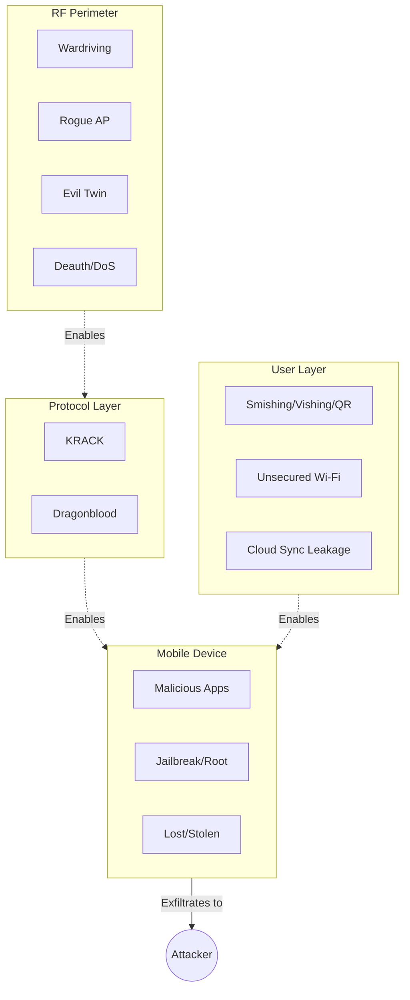
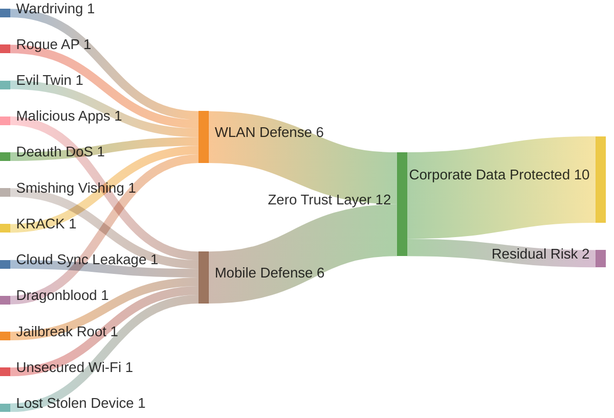

# Wireless & Mobile Threat Model

> Threat taxonomy covering the top 6 WLAN threats and top 6 mobile threats, with STRIDE categorization, MITRE ATT&CK Mobile mapping, and concrete mitigation controls.

## Table of Contents

- [Modeling Approach](#modeling-approach)
- [WLAN Threat Catalog](#wlan-threat-catalog)
- [Mobile Threat Catalog](#mobile-threat-catalog)
- [Adjacent Wireless Threats — Bluetooth/BLE](#adjacent-wireless-threats--bluetoothble)
- [STRIDE Summary](#stride-summary)
- [Wireless Protocol Comparison](#wireless-protocol-security-comparison)
- [Attack Surface Diagram](#attack-surface-diagram)
- [References](#references)

## Modeling Approach

Threats are classified using **STRIDE** (Spoofing, Tampering, Repudiation, Information Disclosure, Denial of Service, Elevation of Privilege) and mapped to **MITRE ATT&CK Mobile Matrix** tactics and techniques where applicable. Each threat entry documents:

- **Attack vector** — the technical mechanism
- **Attacker motivation** — what the attacker gains
- **Impact severity** — business consequence
- **STRIDE category** — the security property violated
- **Mitigation stack** — layered controls that break the attack

## WLAN Threat Catalog

### 1. Wardriving / RF Reconnaissance

| Attribute | Detail |
|---|---|
| Attack vector | Drive/walk with Wi-Fi scanner, capture SSIDs/BSSIDs/encryption types/signals |
| Motivation | Target identification, Preferred Network List (PNL) harvesting |
| Impact | Low direct; enables subsequent phases (evil twin, KRACK, etc.) |
| STRIDE | Information Disclosure |
| MITRE ATT&CK | TA0043 Reconnaissance |
| Mitigations | Transmit power tuning · WIPS detection · Honeypot SSIDs · Reduced SSID broadcast zones |

### 2. Rogue Access Point

| Attribute | Detail |
|---|---|
| Attack vector | Unauthorized AP connected to corp network (external attacker, shadow-IT, malicious insider) |
| Motivation | Establish backdoor bypassing perimeter defenses |
| Impact | Critical — full internal network exposure |
| STRIDE | Elevation of Privilege, Tampering |
| MITRE ATT&CK | T1200 (Hardware Additions) |
| Mitigations | WIPS with automated containment · 802.1X port-based NAC · Physical security · Regular wireless sweeps |

### 3. Evil Twin AP

| Attribute | Detail |
|---|---|
| Attack vector | Spoof legitimate SSID with stronger signal to attract client associations |
| Motivation | Credential capture via captive portal, MITM interception |
| Impact | High — credential theft, session hijacking, data capture |
| STRIDE | Spoofing, Information Disclosure |
| MITRE ATT&CK | T1557 Adversary-in-the-Middle |
| Mitigations | WPA2/WPA3-Enterprise with server certificate validation · WIPS evil twin detection · Client-side AP certificate pinning · User training on network validation |

### 4. KRACK (Key Reinstallation Attack)

| Attribute | Detail |
|---|---|
| Attack vector | Replay WPA2 4-way handshake messages to force nonce reuse |
| Motivation | Decrypt encrypted wireless traffic without knowing the passphrase |
| Impact | High — encrypted traffic decryption, packet injection |
| STRIDE | Information Disclosure, Tampering |
| MITRE ATT&CK | T1040 Network Sniffing |
| Mitigations | AP + client firmware patches · Migrate to WPA3-SAE · Use VPN as defense-in-depth |

### 5. Dragonblood (WPA3 Vulnerabilities)

| Attribute | Detail |
|---|---|
| Attack vector | Timing side-channel attacks on WPA3-SAE password element derivation |
| Motivation | Recover WPA3 passphrase via offline brute force |
| Impact | High — passphrase recovery |
| STRIDE | Information Disclosure, Elevation of Privilege |
| MITRE ATT&CK | T1110 Brute Force |
| Mitigations | Firmware updates implementing H2E (Hash-to-Element) · Strong passphrase length · Disable vulnerable groups (MODP 22/23/24) |

### 6. Deauthentication / DoS

| Attribute | Detail |
|---|---|
| Attack vector | Forge 802.11 deauth frames to disconnect legitimate clients |
| Motivation | Disrupt connectivity, force reconnect to evil twin, degrade availability |
| Impact | Medium — service disruption, reconnection attacks |
| STRIDE | Denial of Service |
| MITRE ATT&CK | T1498 Network Denial of Service |
| Mitigations | 802.11w Protected Management Frames (PMF) · WIPS deauth detection · Redundant AP coverage |

## Mobile Threat Catalog

### 1. Malicious Applications (Trojanized Apps / Spyware)

| Attribute | Detail |
|---|---|
| Attack vector | Sideloaded trojanized app, modified legitimate app, enterprise spyware |
| Motivation | Data theft, credential capture, device surveillance, corporate espionage |
| Impact | Critical — persistent device compromise |
| STRIDE | Spoofing, Tampering, Information Disclosure, Elevation of Privilege |
| MITRE ATT&CK Mobile | T1660 Phishing (delivery) · T1407 Download New Code at Runtime (persistence) — *replaces deprecated T1476* |
| Mitigations | MDM app whitelisting · App store validation · Mobile Threat Defense (MTD) · App containerization · Jailbreak/root detection |

### 2. Smishing / Vishing / QR Phishing

| Attribute | Detail |
|---|---|
| Attack vector | SMS, voice call, or QR code delivering phishing link |
| Motivation | Credential theft, malware delivery, social engineering |
| Impact | High — account compromise, corporate access |
| STRIDE | Spoofing, Information Disclosure |
| MITRE ATT&CK Mobile | T1660 Phishing |
| Mitigations | MTD URL filtering · MFA on all corporate accounts · User awareness training · SMS filtering policies |

### 3. Insecure Cloud Sync / Shadow IT Data Leakage

| Attribute | Detail |
|---|---|
| Attack vector | Corporate data auto-synced to personal cloud accounts (Google Drive, Dropbox, iCloud) |
| Motivation | Usually unintentional user behavior, occasionally malicious insider |
| Impact | High — uncontrolled data exposure, compliance violations |
| STRIDE | Information Disclosure |
| MITRE ATT&CK Mobile | T1639 Exfiltration Over Alternative Protocol |
| Mitigations | CASB (Cloud Access Security Broker) · MAM with per-app DLP · App containerization · Corporate cloud alternatives |

### 4. Jailbreaking / Rooting

| Attribute | Detail |
|---|---|
| Attack vector | User or malware bypasses OS sandbox to gain root privileges |
| Motivation | Install restricted apps, bypass corporate policies, enable deeper malware |
| Impact | Critical — all OS-level security controls bypassable |
| STRIDE | Elevation of Privilege, Tampering |
| MITRE ATT&CK Mobile | T1404 Exploitation for Privilege Escalation |
| Mitigations | MDM root/jailbreak detection · Automated device quarantine · Certificate-based device identity revocation |

### 5. Unsecured Public Wi-Fi Connection

| Attribute | Detail |
|---|---|
| Attack vector | Device auto-connects to open or familiar-named network in public space |
| Motivation | Attacker MITM via coffee-shop Wi-Fi, airport hotspots |
| Impact | High — credential theft, session hijacking |
| STRIDE | Spoofing, Information Disclosure |
| MITRE ATT&CK Mobile | T1638 Adversary-in-the-Middle |
| Mitigations | MDM always-on VPN · Disable auto-join for open networks · DNS-over-HTTPS enforcement · User awareness |

### 6. Lost / Stolen Device

| Attribute | Detail |
|---|---|
| Attack vector | Physical theft or loss of unlocked/weakly-protected device |
| Motivation | Data theft, account takeover via persistent sessions |
| Impact | Critical (without remote wipe) |
| STRIDE | Information Disclosure, Elevation of Privilege |
| MITRE ATT&CK Mobile | T1420 File and Directory Discovery |
| Mitigations | Mandatory device encryption · Strong lock (PIN + biometric) · Auto-lock timeout · Remote wipe via MDM · Selective wipe for BYOD |

## Adjacent Wireless Threats — Bluetooth/BLE

> While course content focused on Wi-Fi and mobile device security, adjacent wireless protocols present additional attack surface in BYOD environments.

Bluetooth and Bluetooth Low Energy (BLE) are enabled by default on most BYOD smartphones, tablets, and laptops. In a 60-employee BYOD environment like Bluegreen Media, these protocols create passive attack surface even when corporate Wi-Fi controls are fully deployed.

| Threat | STRIDE | MITRE Technique | Impact | Mitigation |
|---|---|---|---|---|
| **BlueBorne** (CVE-2017-0781 family) — Remote code execution via Bluetooth stack overflow; no pairing or user interaction required | Elevation of Privilege, Tampering | T1428 Exploitation of Remote Services | Critical — full device compromise over-the-air within ~10m range | MDM-enforced OS patching · Bluetooth disable policy when not in use · Network-level device quarantine for unpatched endpoints |
| **BLE Tracking & Beacon Spoofing** — Passive tracking of persistent BLE advertisements; spoofed BLE beacons to trigger malicious actions on nearby devices | Information Disclosure, Spoofing | T1422 System Network Configuration Discovery · T1644 Generate Traffic from Victim | Medium — employee location tracking, social engineering enablement, phishing via spoofed beacon notifications | MAC address randomization enforcement · MDM policy restricting BLE beacon response · Disable unnecessary BLE services |
| **KNOB Attack** (CVE-2019-9506) — Key Negotiation of Bluetooth forces entropy reduction to 1 byte, enabling brute-force of session key | Information Disclosure | T1040 Network Sniffing | High — real-time eavesdropping on Bluetooth communications (calls, file transfers, keyboard input) | Firmware updates enforcing minimum 7-byte entropy · MDM-managed Bluetooth stack updates · Avoid Bluetooth for sensitive data transfer |
| **BIAS Attack** (CVE-2020-10135) — Bluetooth Impersonation Attacks on Secure connections; attacker impersonates previously paired device to establish unauthenticated session | Spoofing, Elevation of Privilege | T1638 Adversary-in-the-Middle | High — unauthorized access to paired device resources, session hijacking of Bluetooth peripherals | Firmware patches per Bluetooth SIG advisory · Mutual authentication enforcement · Remove stale pairings via MDM policy · Physical verification for new pairings |

> **Scope note:** These threats are documented for completeness but were not included in the quantified risk assessment or STRIDE summary counts, which cover the 12 primary WLAN and mobile threats analyzed in the course curriculum. Organizations should assess BLE risk separately based on their Bluetooth usage profile.

## STRIDE Summary

Count of threats per STRIDE category across the 12 cataloged threats:

| STRIDE Category | RF Perimeter | Protocol Layer | Mobile Device | User Layer | **Total** |
|---|---|---|---|---|---|
| **Spoofing** | Evil Twin · Rogue AP | | | Smishing/Vishing · Unsecured Wi-Fi | **4** |
| **Tampering** | Rogue AP | KRACK | Malicious Apps · Jailbreak/Root | | **4** |
| **Repudiation** | | | | | **0** |
| **Information Disclosure** | Wardriving · Evil Twin | KRACK · Dragonblood | Lost/Stolen Device | Smishing · Unsecured Wi-Fi · Cloud Sync | **7** |
| **Denial of Service** | Deauth/DoS | | | | **1** |
| **Elevation of Privilege** | Rogue AP | Dragonblood | Malicious Apps · Jailbreak/Root | | **4** |

**Observations:**

- **Information Disclosure dominates** (7/12 threats) — wireless and mobile are inherently about data accessibility across trust boundaries
- **No repudiation threats** in this catalog — wireless attacks rarely revolve around deniability
- **Denial of Service appears only once** — deauth attacks are the main availability concern; most wireless threats target confidentiality

### Risk Heat Map (Likelihood × Impact)

Each of the 12 cataloged threats plotted on a 5×5 risk matrix. Likelihood and impact assessed qualitatively based on the Bluegreen Media scenario (60-employee SMB, 10 APs, BYOD, pre-IPO).

| | **Impact: Negligible** | **Impact: Low** | **Impact: Moderate** | **Impact: High** | **Impact: Critical** |
|---|---|---|---|---|---|
| **Likelihood: Almost Certain** | | | | Unsecured Public Wi-Fi | Data Leakage via Cloud Sync |
| **Likelihood: Likely** | | | Deauth/DoS | Smishing/Vishing | Malicious Apps |
| **Likelihood: Possible** | | | | Evil Twin AP · Lost/Stolen Device | Rogue AP · Jailbreak/Root |
| **Likelihood: Unlikely** | | Wardriving (recon only) | | KRACK | |
| **Likelihood: Rare** | | | | Dragonblood | |

**Risk treatment priorities (red = mitigate immediately, orange = mitigate within 90 days):**

- **Critical risk (top-right):** Data Leakage via Cloud Sync, Malicious Apps, Rogue AP, Jailbreak/Root — require immediate MDM + CASB + NAC controls
- **High risk:** Evil Twin, Lost/Stolen Device, Smishing, Unsecured Public Wi-Fi — require WIPS + MDM + user training
- **Medium risk:** Deauth/DoS, KRACK — require PMF + firmware patching
- **Low risk:** Wardriving (recon only), Dragonblood (rare in practice with H2E) — monitor via WIPS

> **Methodology:** Likelihood based on threat actor accessibility and Bluegreen Media's current control posture (pre-remediation). Impact based on potential data exposure, business disruption, and IPO-readiness implications. Assessment follows NIST SP 800-30 qualitative risk analysis guidance.

### Quantified Risk Assessment

Semi-quantitative risk scores aligned with NIST SP 800-30 and CVSS v3.1 methodology. Likelihood scored 1-5, Impact scored 1-5, Risk = Likelihood × Impact (max 25).

| Threat | Likelihood (1-5) | Impact (1-5) | Risk Score | CVSS Base (est.) | Risk Level | Priority |
|---|---|---|---|---|---|---|
| Data Leakage via Cloud Sync | 5 (Almost Certain) | 5 (Critical) | **25** | 8.1 | 🔴 Critical | Immediate |
| Malicious Apps | 4 (Likely) | 5 (Critical) | **20** | 8.8 | 🔴 Critical | Immediate |
| Rogue AP | 3 (Possible) | 5 (Critical) | **15** | 7.5 | 🟠 High | Within 30 days |
| Jailbreak/Root | 3 (Possible) | 5 (Critical) | **15** | 7.8 | 🟠 High | Within 30 days |
| Unsecured Public Wi-Fi | 5 (Almost Certain) | 4 (High) | **20** | 6.8 | 🔴 Critical | Immediate |
| Smishing/Vishing | 4 (Likely) | 4 (High) | **16** | 7.1 | 🟠 High | Within 30 days |
| Evil Twin AP | 3 (Possible) | 4 (High) | **12** | 7.4 | 🟠 High | Within 30 days |
| Lost/Stolen Device | 3 (Possible) | 4 (High) | **12** | 6.2 | 🟡 Medium | Within 90 days |
| Deauth/DoS | 4 (Likely) | 3 (Moderate) | **12** | 5.3 | 🟡 Medium | Within 90 days |
| KRACK | 2 (Unlikely) | 4 (High) | **8** | 6.8 | 🟡 Medium | Within 90 days |
| Wardriving | 2 (Unlikely) | 2 (Low) | **4** | 3.1 | 🟢 Low | Monitor |
| Dragonblood | 1 (Rare) | 4 (High) | **4** | 5.9 | 🟢 Low | Monitor |

> **Scoring methodology:** Likelihood based on Bluegreen Media's pre-remediation control posture (60 employees, BYOD, no NAC/MDM/WIPS). Impact based on potential data exposure volume, business disruption severity, and IPO-readiness implications. CVSS base estimates use the FIRST CVSS v3.1 calculator with attack vector=Adjacent (WLAN threats) or Network (mobile threats), adjusted for complexity and privilege requirements. Risk levels: Critical (20-25), High (12-19), Medium (6-11), Low (1-5).

**Annualized Loss Expectancy (illustrative for Bluegreen Media):**

| Risk Level | Representative Threat | Single Loss Expectancy | Annual Rate of Occurrence | ALE |
|---|---|---|---|---|
| Critical | Data breach via cloud sync | $180,000 (regulatory fines + incident response + reputation) | 0.7 | **$126,000/yr** |
| High | Rogue AP leading to network compromise | $95,000 (IR + forensics + downtime) | 0.3 | **$28,500/yr** |
| Medium | Deauth/DoS on guest network | $8,000 (productivity loss + IT response) | 2.0 | **$16,000/yr** |
| Low | Wardriving reconnaissance | $2,000 (investigation time) | 1.5 | **$3,000/yr** |

> **Note:** ALE figures are rough-order-of-magnitude estimates for a 60-employee pre-IPO company. They demonstrate the risk quantification methodology; actual values require asset valuation and actuarial data specific to the organization.

### Control-to-Threat Mapping

Which defensive control breaks which threat. ● = primary control, ○ = compensating control.

| Threat | NAC (802.1X) | MDM/MAM | WIPS | WPA3-SAE | VPN | CASB | User Training |
|---|---|---|---|---|---|---|---|
| Wardriving | | | ● | ○ | | | |
| Rogue AP | ● | | ● | | | | |
| Evil Twin | ○ | | ● | ● | ○ | | ● |
| KRACK | | | | ● | ○ | | |
| Dragonblood | | | | ● | ○ | | |
| Deauth/DoS | | | ● | ○ (PMF) | | | |
| Malicious Apps | | ● | | | | ○ | ● |
| Smishing/Vishing | | ○ | | | | | ● |
| Cloud Sync Leakage | | ● | | | | ● | ○ |
| Jailbreak/Root | | ● | | | | | |
| Unsecured Public Wi-Fi | | ○ | | | ● | | ● |
| Lost/Stolen Device | | ● | | | | | |

**Key insight from STRIDE analysis:** Information Disclosure dominates (7/12 threats), meaning **confidentiality controls must be prioritized**: CASB for cloud data, VPN for transit data, MDM containerization for data-at-rest, and WPA3 for wireless-layer encryption. The control stack should be evaluated primarily through a confidentiality lens, with integrity and availability as secondary concerns for this threat landscape.

### Wireless Protocol Security Comparison

| Protocol | Encryption | Key Exchange | Authentication | Known Vulnerabilities | Recommendation |
|---|---|---|---|---|---|
| **WEP** | RC4 (40/104-bit) | Static shared key | Open/Shared Key | FMS, PTW, Chop-Chop — broken in minutes | ❌ Never use — remove immediately if found |
| **WPA-TKIP** | RC4 + TKIP MIC | PSK or 802.1X | PSK or Enterprise | Beck-Tews, Ohigashi-Morii — TKIP deprecated | ❌ Deprecated — migrate to WPA2 minimum |
| **WPA2-PSK** | AES-CCMP | Pre-Shared Key (4-way handshake) | PSK | Offline dictionary attack on captured handshake; KRACK (patched) | ⚠️ Acceptable for small networks with strong passphrase (20+ chars) |
| **WPA2-Enterprise** | AES-CCMP | 802.1X / EAP-TLS | RADIUS + certificates | KRACK (patched); server certificate validation required | ✅ Recommended for corporate environments |
| **WPA3-SAE** | AES-CCMP or AES-GCMP | Simultaneous Authentication of Equals (SAE) | SAE (password-based Diffie-Hellman) | Dragonblood (mitigated by H2E); transition mode downgrade | ✅ Recommended — forward secrecy + offline attack resistance |
| **WPA3-Enterprise** | AES-256-GCMP | 802.1X / EAP-TLS | RADIUS + certificates + 192-bit suite | No known practical attacks (as of 2025) | ✅ Best available — required for high-sensitivity environments |

> **Lab evidence:** Lab 1 detected `BananaStand` using WEP — confirming that deprecated protocols persist in real environments. Lab 1 hardening applied WPA2-PSK as the minimum baseline. The Bluegreen Media case study recommends WPA2-Enterprise as the target state with WPA3-SAE migration path.

## Attack Surface Diagram

### Threat-to-Control Flow

How the 12 cataloged threats flow through the three defensive control layers before reaching corporate data:

> **Reading the diagram:** Each threat enters its primary control layer (WLAN or Mobile Defense). Both layers feed into the Zero Trust Layer for continuous verification. The majority of threats are neutralized before reaching corporate data; residual risk represents threats that bypass multiple layers (e.g., zero-day + compromised credential + compliant-looking device).

## References

- [MITRE ATT&CK Mobile Matrix](https://attack.mitre.org/matrices/mobile/)
- [OWASP Mobile Top 10](https://owasp.org/www-project-mobile-top-10/)
- [OWASP MASVS](https://mas.owasp.org/MASVS/)
- [Microsoft STRIDE Threat Model](https://learn.microsoft.com/en-us/azure/security/develop/threat-modeling-tool-threats)
- [KRACK Attacks](https://www.krackattacks.com/)
- [Dragonblood (WPA3)](https://papers.mathyvanhoef.com/dragonblood.pdf)

---

*Ross Moravec | Mobile Wireless Security Portfolio*
