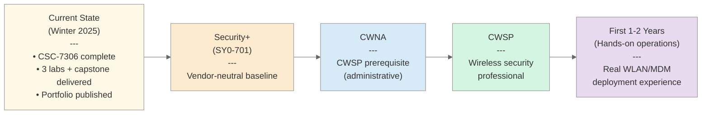
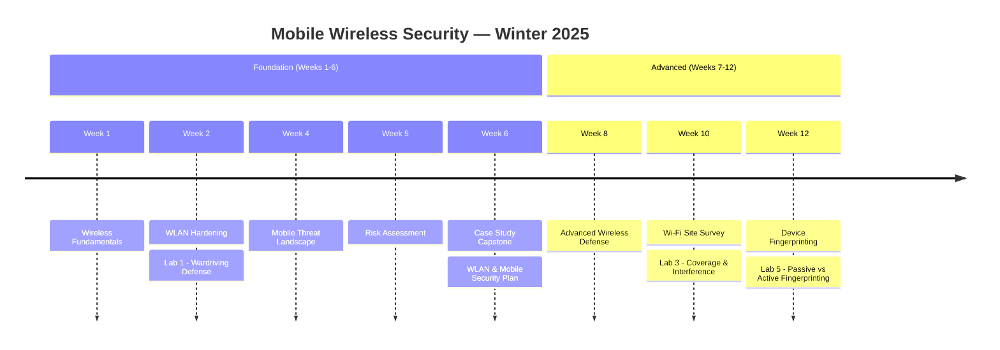
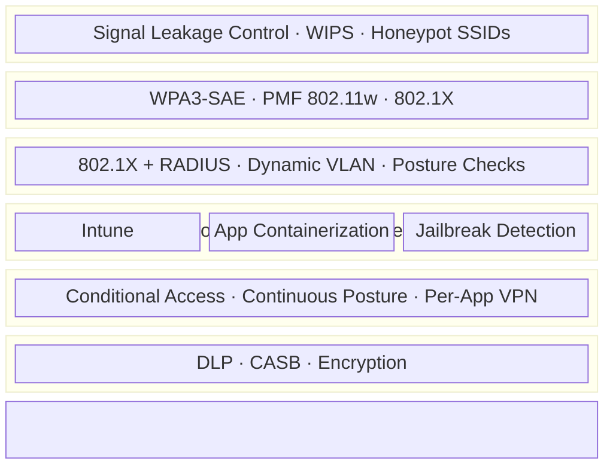
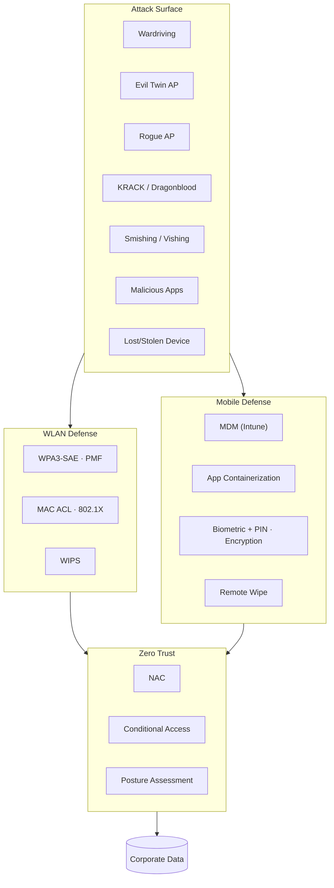
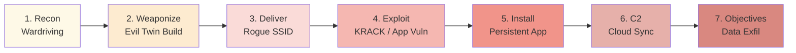

# Mobile & Wireless Security — WLAN Defense & Mobile Device Portfolio

[](https://github.com/rossmoravec/405-Mobile-Wireless-Security/actions/workflows/ci.yml)
[](https://github.com/rossmoravec/405-Mobile-Wireless-Security/actions/workflows/gitleaks.yml)
[](https://github.com/rossmoravec/405-Mobile-Wireless-Security/actions/workflows/markdownlint.yml)
[](https://github.com/rossmoravec/405-Mobile-Wireless-Security/actions/workflows/pages.yml)

> **Wireless & Mobile Security Analyst** | WLAN Threat Defense · BYOD/MDM · Zero Trust Mobile Architecture
> Targeting roles in **Wireless Security**, **Mobile Device Security**, and **BYOD/MDM Administration**

**Ross Moravec** | Cambrian College | CSC-7306 Mobile Wireless Security | Winter 2025

[](https://www.linkedin.com/in/rossmoravec/)
[](https://github.com/rossmoravec)
[](mailto:ross@moravec.dev)

> 12-week term (8 instructor-led sessions) covering WLAN hardening, wireless site survey methodology, mobile device fingerprinting, and a capstone WLAN & Mobile Security Plan for a fictional SMB considering an IPO.

---

## Professional Summary

Graduate of Cambrian College's Postgraduate Cybersecurity Certificate program with hands-on experience in **wireless network security, mobile device security, and BYOD/MDM architecture**. Skilled in WLAN threat analysis, wireless site survey methodology, device fingerprinting, and designing comprehensive security plans that integrate NAC, MDM, and WIPS controls under Zero Trust principles. **Targeting an entry-level role in wireless security analysis, mobile device security administration, or BYOD/MDM engineering** where I can apply practical defensive expertise to modern hybrid-workforce security challenges.

## Why Wireless & Mobile Security?

Wireless and mobile are where *modern enterprise security actually breaks down*. The traditional hard-perimeter model assumed the wire was the boundary — WLAN obliterated that assumption, and BYOD finished the job. Every access point is an extension of the corporate network into RF space that anyone within range can probe. Every personal phone with corporate email is a tiny corporate-data vault that IT doesn't physically control. This is where defense-in-depth stops being theoretical and starts being mandatory: WPA3 + WIPS + NAC + MDM + Zero Trust conditional access aren't optional layers, they're the only way to get back to the security posture wired networks used to have for free. Understanding this stack means understanding how modern enterprise security is actually delivered — not just how it's described in textbooks.

## Certifications & Credentials

> **Current status:** no industry certifications held yet. The statements below distinguish *credentials held* from *in-progress study* from *coursework that aligns with certification domains*.

| Credential | Status | Notes |
|------------|--------|-------|
| **CWSP (Certified Wireless Security Professional)** | Planned | CSC-7306 course content maps to all 6 CWSP exam domains; used coursework as hands-on preparation |
| **CompTIA Security+ (SY0-701)** | In progress — self-study | Target sitting: next availability window after focused review |
| **CWNA (Certified Wireless Network Administrator)** | Prerequisite for CWSP | Will pursue if CWSP path pursued formally |

**CWSP content alignment (not a certification claim):** The course content maps to all six CWSP exam domains as documented in [CWSP Alignment](CC/Winter%202025/Mobile%20Wireless%20Security%20-%20Mohamed%20Jbeili%20-%20CSC-7306/README.md#certification-alignment). This means the portfolio demonstrates work across every domain the exam tests — it does **not** mean I have passed the exam.

### Certification Roadmap



> **Sequencing rationale:** Security+ is the vendor-neutral baseline most entry-level postings filter on; CWNA establishes administrative wireless competency as the CWSP prerequisite; CWSP validates the security-specific work in this portfolio; real-world operations experience is required before pursuing expert-level certs.

## About This Portfolio

This portfolio documents hands-on wireless and mobile security skills developed through Cambrian College's CSC-7306 Mobile Wireless Security course. The work demonstrates practical competency across the modern wireless/mobile defense stack — from defensive WLAN hardening through coverage analysis, device fingerprinting, threat modeling, and a comprehensive enterprise security plan. Each lab builds progressively, and the capstone case study integrates everything into a business-context security strategy for a fictional SMB.

## Quick Start for Hiring Managers

| Time | What to Review |
|------|---------------|
| **5 min** | This README + [architecture diagram below](#defense-in-depth-architecture) |
| **15 min** | [Course Portfolio Landing](CC/Winter%202025/Mobile%20Wireless%20Security%20-%20Mohamed%20Jbeili%20-%20CSC-7306/README.md) + [Labs Summary](CC/Winter%202025/Mobile%20Wireless%20Security%20-%20Mohamed%20Jbeili%20-%20CSC-7306/WEEKLY_LABS_SUMMARY.md) |
| **30 min** | [Capstone Case Study](CC/Winter%202025/Mobile%20Wireless%20Security%20-%20Mohamed%20Jbeili%20-%20CSC-7306/CASE_STUDY_CAPSTONE.md) + [12-Week Curriculum Map](CC/Winter%202025/Mobile%20Wireless%20Security%20-%20Mohamed%20Jbeili%20-%20CSC-7306/WEEKLY_TOPIC_MAP.md) + browse [lab submissions](CC/Winter%202025/Mobile%20Wireless%20Security%20-%20Mohamed%20Jbeili%20-%20CSC-7306/assignments/) |
| **Deep dive** | [Cyber Kill Chain Analysis](CC/Winter%202025/Mobile%20Wireless%20Security%20-%20Mohamed%20Jbeili%20-%20CSC-7306/CYBER_KILL_CHAIN_ANALYSIS.md) · [Threat Model](CC/Winter%202025/Mobile%20Wireless%20Security%20-%20Mohamed%20Jbeili%20-%20CSC-7306/WIRELESS_THREAT_MODEL.md) · [BYOD Framework](CC/Winter%202025/Mobile%20Wireless%20Security%20-%20Mohamed%20Jbeili%20-%20CSC-7306/BYOD_POLICY_FRAMEWORK.md) |

## Key Achievements

| Metric | Value | Evidence |
|--------|-------|----------|
| Labs completed | **3** hands-on wireless/mobile labs | [assignments/](CC/Winter%202025/Mobile%20Wireless%20Security%20-%20Mohamed%20Jbeili%20-%20CSC-7306/assignments/) |
| Capstone delivered | **Bluegreen Media WLAN & Mobile Security Plan** (3 parts + Cyber Kill Chain + Presentation) | [CASE_STUDY_CAPSTONE.md](CC/Winter%202025/Mobile%20Wireless%20Security%20-%20Mohamed%20Jbeili%20-%20CSC-7306/CASE_STUDY_CAPSTONE.md) |
| Threats catalogued | **12** (6 WLAN + 6 mobile) with STRIDE + MITRE ATT&CK Mobile mapping | [WIRELESS_THREAT_MODEL.md](CC/Winter%202025/Mobile%20Wireless%20Security%20-%20Mohamed%20Jbeili%20-%20CSC-7306/WIRELESS_THREAT_MODEL.md) |
| Strategic recommendations | **3** (NAC · MDM+Zero Trust · WIPS) with 16-20 week implementation plans | [CASE_STUDY_CAPSTONE.md#strategic-recommendations](CC/Winter%202025/Mobile%20Wireless%20Security%20-%20Mohamed%20Jbeili%20-%20CSC-7306/CASE_STUDY_CAPSTONE.md#strategic-recommendations) |
| Weeks covered | **8** instructor-led sessions across a 12-week term with progressive skill building | [WEEKLY_TOPIC_MAP.md](CC/Winter%202025/Mobile%20Wireless%20Security%20-%20Mohamed%20Jbeili%20-%20CSC-7306/WEEKLY_TOPIC_MAP.md) |
| Tools mastered | **7** (GHostAPd · LinSSID · Wireshark · p0f · Nmap · ClientJS · Site Survey tools) | [WEEKLY_LABS_SUMMARY.md#tool-mastery-summary](CC/Winter%202025/Mobile%20Wireless%20Security%20-%20Mohamed%20Jbeili%20-%20CSC-7306/WEEKLY_LABS_SUMMARY.md#tool-mastery-summary) |
| CWSP exam domain coverage | **6/6** domains mapped to course work | [CWSP Alignment](CC/Winter%202025/Mobile%20Wireless%20Security%20-%20Mohamed%20Jbeili%20-%20CSC-7306/README.md#certification-alignment) |

<details>
<summary><strong>12-Week Curriculum Timeline</strong> — click to expand</summary>



</details>

## Defense in Depth Architecture

Wireless and mobile security layers built up across the course, from RF perimeter to Zero Trust data access:



## Wireless Threat Landscape



## Cyber Kill Chain — Wireless & Mobile Context



> **Legend:** Warm-to-hot color gradient (yellow → red) tracks escalating attacker impact across the seven kill chain phases. Each node lists phase number, abbreviated name, and representative wireless/mobile TTPs.

- **NAC** breaks Delivery (unauthorized devices can't reach corporate resources)
- **MDM + Zero Trust** breaks Installation + C2 + Objectives (no persistent foothold, no trusted lateral movement)
- **WIPS** breaks Reconnaissance + Delivery (rogue AP detection + containment)

See [CYBER_KILL_CHAIN_ANALYSIS.md](CC/Winter%202025/Mobile%20Wireless%20Security%20-%20Mohamed%20Jbeili%20-%20CSC-7306/CYBER_KILL_CHAIN_ANALYSIS.md) for full phase-by-phase defensive control mapping.

## Skills Demonstrated

| Domain | Technologies & Frameworks |
|--------|---------------------------|
| **WLAN Security Architecture** | WPA2/WPA3, 802.1X, EAP, SAE, PMF (802.11w), CCMP, GHostAPd |
| **Wireless Threat Analysis** | Wardriving, Evil Twin, Rogue AP, Deauth/DoS, KRACK, Dragonblood |
| **Site Survey & Coverage** | Heatmap generation, SIR analysis, 802.11 PHY modes (n/ac), dead zone detection, multi-band analysis |
| **Mobile Device Security** | Android/iOS hardening, jailbreak/root detection, biometric auth, full-device encryption |
| **Device Fingerprinting** | Wireshark passive, p0f, Nmap active, ClientJS, User-Agent analysis, TTL fingerprinting |
| **BYOD/MDM Architecture** | Microsoft Intune, app containerization, selective wipe, MAM, conditional access |
| **Network Access Control** | Cisco ISE, Aruba ClearPass, Forescout, 802.1X + RADIUS, dynamic VLAN assignment |
| **Zero Trust** | Continuous device posture, conditional access, context-aware policies, microsegmentation |
| **Threat Modeling** | STRIDE, PASTA, MITRE ATT&CK Mobile Matrix, Cyber Kill Chain |
| **Risk Frameworks** | NIST SP 800-30, NIST SP 800-153, NIST SP 800-124r2, NIST SP 800-207, ISO 27005, CIS Controls v8 |

## Course Content Alignment

The course content maps directly to the **CWNP CWSP (Certified Wireless Security Professional)** certification:

| CWSP Domain | Weight | Course Coverage |
|---|---|---|
| Security Policy | 10% | Case Study Part 3 (BYOD policy framework, acceptable use, compliance) |
| Vulnerabilities, Threats, and Attacks | 30% | Weeks 1-2, 4; Case Study Part 1 (12 threats catalogued + analyzed) |
| WLAN Security Design and Architecture | 20% | Week 2 (Lab 1); Case Study Part 3 (3 strategic recommendations) |
| Security Lifecycle Management | 20% | Week 5; Case Study Part 2 (audit + risk assessment plans) |
| WLAN Monitoring and Management | 10% | Week 10 (Lab 3); Case Study Rec #3 (WIPS + analytics) |
| Deploying Fast Secure Roaming | 10% | Week 8 (802.11r/k/v concepts) |

## Lab Portfolio Highlights

**3 labs completed** spanning the defensive-to-offensive wireless/mobile spectrum:

- **Lab 1 (Week 2) — Wardriving Defense:** Progressive hardening of an open WLAN through GHostAPd: WPA2-PSK, MAC ACL (Default Deny + allow list), transmit power tuning, verified with LinSSID scanning
- **Lab 3 (Week 10) — Wi-Fi Site Survey:** Professional coverage analysis with heatmaps, SIR calculation, PHY mode identification (802.11n/ac), dead zone detection at -88 dBm / -25 dB SIR thresholds
- **Lab 5 (Week 12) — Mobile Device Fingerprinting:** Comparative passive (Wireshark, p0f) vs active (Nmap -O, ClientJS) fingerprinting; User-Agent analysis across Chrome/Firefox/Edge on Android/Windows; identified Android 9.x via passive methods

Full details: [WEEKLY_LABS_SUMMARY.md](CC/Winter%202025/Mobile%20Wireless%20Security%20-%20Mohamed%20Jbeili%20-%20CSC-7306/WEEKLY_LABS_SUMMARY.md)

## Capstone Case Study — Bluegreen Media WLAN & Mobile Security Plan

**Scenario:** Fictional 60-employee social media company (Bluegreen Media) in a 20,000 sqft facility, operating 10 APs, employing 5 traveling account reps on BYOD, and considering an IPO. CEO Jennifer needs a comprehensive WLAN + mobile security plan that scales.

**Deliverables:**

- **Part 1:** WLAN & Mobile Vulnerability Analysis Plan (5-phase methodology: Network Discovery → Config Assessment → Penetration Testing → Mobile Device Security → Risk-Based Reporting)
- **Part 2:** Audit & Risk Assessment Plan (NIST SP 800-30 + ISO 27005; quarterly/monthly/bi-monthly audit cadence; STRIDE + PASTA threat modeling)
- **Part 3:** BYOD Policy Framework (tiered model, 5 component categories) + 3 Strategic Recommendations

**3 Strategic Recommendations with 16-20 week implementation plans:**

1. **Network Access Control (NAC)** — Cisco ISE/Aruba ClearPass/Forescout with 802.1X + RADIUS, dynamic VLAN, posture-based access → 100% device visibility, 95% unauthorized connection reduction
2. **MDM + Zero Trust Integration** — Microsoft Intune with app containerization, jailbreak detection, certificate-based identity, continuous posture → 99% compliance rate
3. **Wireless Intrusion Prevention (WIPS)** — Dedicated sensors, rogue AP containment, evil twin detection, SIEM integration → 95% reduction in wireless attack dwell time

Full writeup: [CASE_STUDY_CAPSTONE.md](CC/Winter%202025/Mobile%20Wireless%20Security%20-%20Mohamed%20Jbeili%20-%20CSC-7306/CASE_STUDY_CAPSTONE.md)

## Architecture Principles

Three design principles that define effective wireless & mobile security:

1. **Wireless security is perimeter security without a perimeter.** Traditional network security assumed a hard perimeter — the wire. WLAN erodes that assumption: every AP is an extension of the corporate network into RF space that attackers can access from the parking lot. WPA3 + WIPS + NAC are the compensating controls that restore the perimeter logically when the physical one is gone.

2. **BYOD is a compensating control, not a default.** Letting employees use personal devices saves hardware costs, but it shifts the security burden from device-ownership to device-posture. Every BYOD deployment needs MDM, containerization, and conditional access to approximate the visibility and control you'd get from corporate-owned devices. Without those controls, BYOD is unmanaged risk dressed up as cost savings.

3. **Identity matters more than location on wireless.** On wired networks, being plugged into a port often implied authorization. On wireless, the port is *air* — anyone within range can try to authenticate. User-ID, 802.1X, and certificate-based device authentication shift the trust boundary from the physical to the identity layer. This is the foundational insight that makes Zero Trust coherent on wireless.

<details>
<summary><strong>Repository Structure</strong> — click to expand</summary>

```text
405-Mobile-Wireless-Security/
├── README.md                 (this file — employer-facing portfolio)
├── CC/
│   └── Winter 2025/
│       └── Mobile Wireless Security - Mohamed Jbeili - CSC-7306/
│           ├── README.md                     (course landing page)
│           ├── WEEKLY_TOPIC_MAP.md           (12-week curriculum)
│           ├── WEEKLY_LABS_SUMMARY.md        (lab portfolio narrative)
│           ├── CASE_STUDY_CAPSTONE.md        (Bluegreen Media capstone)
│           ├── CYBER_KILL_CHAIN_ANALYSIS.md  (kill chain applied to wireless)
│           ├── WIRELESS_THREAT_MODEL.md      (STRIDE + ATT&CK Mobile)
│           ├── BYOD_POLICY_FRAMEWORK.md      (MDM/NAC/Zero Trust synthesis)
│           ├── EVIDENCE_INDEX.md             (artifact & evidence catalog)
│           ├── SCRIPTS_README.md             (script documentation)
│           ├── assignments/                  (6 PDF submissions)
│           └── scripts/                      (student-authored automation)
├── docs/                     (pilot ops: Runbook, Checklist, sessions)
├── portfolio/config.json     (metrics, skills, references)
├── .github/workflows/        (CI: ci, gitleaks, markdownlint, pages, pm-evidence, portfolio-ci)
├── ROADMAP.md                (Now/Next/Later + milestones)
└── LICENSE · SECURITY.md · CONTRIBUTING.md
```

</details>

> **CI/CD:** This repository uses GitHub Actions for automated quality gates — markdown linting, secret scanning (Gitleaks), link validation, and GitHub Pages deployment. Badges at the top of this README reflect current pipeline status.

## Next Steps Toward Production Experience

This portfolio demonstrates academic and lab-based competency. The next phase focuses on bridging to production-grade experience:

| Area | Current State | Next Milestone |
|---|---|---|
| **Wireless security operations** | Lab-based GHostAPd/LinSSID/Wireshark | Contribute to open-source WIPS tooling or home-lab WPA3-Enterprise deployment |
| **MDM administration** | Policy design + Intune template authoring | Deploy Intune in a test tenant with real iOS/Android device enrollment |
| **Penetration testing** | Conceptual knowledge of Evil Twin, KRACK | Complete Offensive Security Wireless Professional (OSWP) labs or equivalent CTF challenges |
| **Incident response** | Kill chain mapping + control design | Participate in a wireless-focused IR tabletop exercise or blue team CTF |
| **Certifications** | Course content aligned to CWSP domains | Pass CompTIA Security+ (SY0-701), then pursue CWNA → CWSP path |
| **Enterprise networking** | NAC architecture design on paper | Gain hands-on experience with Cisco ISE or Aruba ClearPass in an internship or co-op |

> **Availability:** Actively seeking entry-level roles in wireless security analysis, mobile device security administration, or BYOD/MDM engineering. Open to internship, co-op, or junior analyst positions.

## Portfolio Context

This portfolio was developed as part of Cambrian College's Postgraduate Cybersecurity Certificate program (Winter 2025). All narrative documents, threat analysis, scripts, and diagrams are original student work. PDF submissions were exported from the Jones & Bartlett Learning LMS and contain embedded lab screenshots. The repository is published on GitHub to demonstrate version control practices, CI/CD hygiene, and professional documentation skills alongside the technical security content.

## References

### Core Standards & Frameworks

- [NIST SP 800-153 — Guidelines for Securing WLANs](https://csrc.nist.gov/publications/detail/sp/800-153/final)
- [NIST SP 800-124r2 — Guidelines for Managing Mobile Device Security](https://csrc.nist.gov/publications/detail/sp/800-124/rev-2/final)
- [NIST SP 800-30 Rev. 1 — Guide for Conducting Risk Assessments](https://csrc.nist.gov/publications/detail/sp/800-30/rev-1/final)
- [NIST SP 800-207 — Zero Trust Architecture](https://csrc.nist.gov/publications/detail/sp/800-207/final)
- [ISO/IEC 27005 — Information Security Risk Management](https://www.iso.org/standard/80585.html)
- [IEEE 802.11 Wireless Standards](https://standards.ieee.org/ieee/802.11/7028/)
- [Wi-Fi Alliance WPA3 Specification](https://www.wi-fi.org/discover-wi-fi/security)

### Threat Intelligence & Modeling

- [MITRE ATT&CK Mobile Matrix](https://attack.mitre.org/matrices/mobile/)
- [OWASP Mobile Top 10](https://owasp.org/www-project-mobile-top-10/)
- [OWASP Mobile Application Security (MASVS)](https://mas.owasp.org/)
- [Lockheed Martin Cyber Kill Chain](https://www.lockheedmartin.com/en-us/capabilities/cyber/cyber-kill-chain.html)
- [KRACK Attack Details](https://www.krackattacks.com/)
- [Dragonblood (WPA3 Vulnerabilities)](https://papers.mathyvanhoef.com/dragonblood.pdf)

### Certifications

- [CWNP CWSP — Certified Wireless Security Professional](https://www.cwnp.com/certifications/cwsp)
- [CWNP CWNA — Certified Wireless Network Administrator](https://www.cwnp.com/certifications/cwna)
- [CompTIA Security+ (SY0-701)](https://www.comptia.org/certifications/security)

---

*Ross Moravec | Mobile & Wireless Security Portfolio | CSC-7306 Winter 2025 | Cambrian College*
